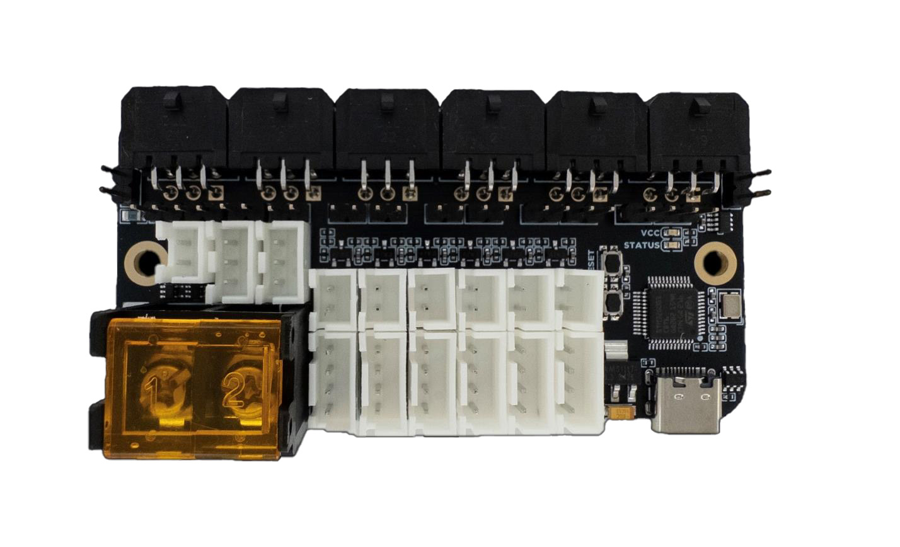

---
hide:
  - footer
---

# Birds' Nest CAN Manual

## Introduction



Birds' Nest CAN is a USB CAN hub PCB designed for tool changers with CAN toolhead PCBs. It features:

- 6x CAN Connectors for Up To 6 Toolheads
- Expansion Ports for More CAN Devices
- Follows ISO 11898 CAN Topology, Increasing Reliability
- 6x 4-pin Filament Sensor Connectors
- 6x Thermistor Connectors
- 2x 5V ARGB Connectors

## Klipper Flashing

!!! info "If you sourced your PCB from an unofficial source, ensure nBOOT_SEL is set to enable BOOT0 before firmware flashing. Official Isik's Tech boards will already have this setting set so you can skip this step."

1. Connect the Birds' Nest CAN to your Raspberry Pi using a USB cable.
2. Hold down the BOOT button. While holding it down, press the RESET button. Release RESET first, then BOOT. Birds' Nest CAN should enter DFU mode.
3. SSH into your Raspberry Pi.
4. Use `lsusb` to make sure you can see the device in DFU mode.
5. Go to the Klipper directory. `cd klipper`
6. Clean remaining files from previous build. `make clean`
7. Choose the options for the build. `make menuconfig` Use the following options:

    ```
    [*] Enable extra low-level configuration options
        Micro-controller Architecture (STMicroelectronics STM32)  --->
        Processor model (STM32G0B1)  --->
        Bootloader offset (No bootloader)  --->
        Clock Reference (8 MHz crystal)  --->
        Communication interface (USB to CAN bus bridge (USB on PA11/PA12))  --->
        CAN bus interface (CAN bus (on PB0/PB1))  --->
        USB ids  --->
    ()  GPIO pins to set at micro-controller startup
    ```

    Press `Q` then `Y` to save and quit the menu.

8. Build. `make`
9. Flash. `make flash FLASH_DEVICE=0483:df11`
10. When finished, press the RESET button on your Birds' Nest CAN PCB.
11. Use `~/klippy-env/bin/python ~/klipper/scripts/canbus_query.py can0` to find the UUID of your Birds' Nest CAN.

## Next Steps

1. Install the PCB on your printer and do the wiring. Pinout can be found below.
2. Download the Klipper config file for Birds' Nest CAN from the Birds' Nest CAN GitHub repository: <https://github.com/xbst/Birds-Nest-CAN/tree/master/Firmware/nest.cfg>
3. Add the downloaded `nest.cfg` file to your printer's config directory. Open the file and edit the UUID.
4. Add `[include nest.cfg]` to your `printer.cfg`.
5. Restart Klipper. `FIRMWARE_RESTART`

## Pinout

{ type=application/pinout style="height:50vh;min-height:500px;width:100%" }

### Important Notes

- The maximum current Birds' Nest CAN can supply to toolheads is 30A. If your toolheads need about 30A or more, turn the hotends on one by one. (Turn one on, when that reaches temp, then turn the next one on) The fuse cannot be replaced without soldering.
- The 5V for the ARGB LEDs is supplied from the USB cable. They are intended to be used for a few LEDs and not LED strips. If planning to use LED strips, connect 5V and GND to the 5V PSU powering the Pi. Wagos on the mount can be used for this. The signal can still come from the Birds' Nest CAN.
- Pinout can also be found on the back side of the PCB.

## CAN Topology

Birds' Nest CAN is a CAN bus hub following a linear bus topology with short stub lengths, unlike other CAN bus hubs on the market. 1Mbit CAN bus standard (ISO 11898) recommends a maximum bus length of 40 meters, with a maximum of 30 nodes (CAN devices) and a <u>maximum stub length of 300mm</u>, with 120-ohm termination resistors on both ends of the bus.

Birds' Nest CAN is designed to keep the stub length as short as possible, and needs a longer bus to follow the recommended specs as closely as possible. This requires the CAN bus to go to the toolhead and come back from there.

You can explore this in the interactive simulator below. Add or remove toolheads, switch a toolhead between 6-wire and 4-wire cabling, move the 120-ohm termination jumpers, and toggle the bypass jumpers behind each port to see how the bus and the signals on it react — including what happens when the recommended topology is not followed.

{ type=application/pinout style="height:80vh;min-height:700px;width:100%" }

Both twisted pairs can be in the same cable. At the hub end, you use the included 6-pin connector, and at the device end, you use a 4-pin connector. <u>The 2 pairs of CAN wires are joined together on the CAN connector, effectively making it a long linear bus.</u> This, of course, means that you need to run more wires to your CAN devices.

There are some 6 wire cables with 2 thick conductors (for power) and 2 pairs of thinner twisted wires (the in and out CAN wires) on the market, like IGUS Chainflex CF113-018-D. These cables are usually designed for servo motors in industrial applications, but they are also suitable for this use case.

The IGUS cable mentioned above can be purchased from Isik's Tech here:

<https://store.isiks.tech/products/can-cable>

It is possible to use Birds' Nest CAN without following this topology by populating jumpers if you prefer to only run 4 wires to your toolheads, however you won't benefit from the potential increased reliability if you choose to do this.

This is the pinout of the 6-pin MX3.0 connector on the Birds' Nest CAN:


As you can see, the outer pins are for the CAN bus. A pair of wires should run from 1 side of the connector on the Birds' Nest CAN to the connector on the CAN device. On the connector on the CAN device, the other pair of CAN wires should be joined with the CAN wires running from the Birds' Nest CAN, and they should run back to the other side of the connector on the Birds' Nest CAN.

<u>If a 6-pin connector is not going to be used, the pin headers behind it need to have jumpers populated.</u> These jumpers connect the CAN pins on both sides of the connector together.

<u>If only using 4 wires to connect your toolhead PCB, you also need to have the jumpers populated.</u> You can use either side of the connector for your CAN wires, they will be shorted together by the jumper.

There are 120-Ohm CAN termination jumpers on the PCB as well. These are at the ends of the linear CAN bus. <u>These should be populated unless you want the termination on a different device</u>, like when using the expansion port.

## Thanks

- ThessienDSD - Beta Tester
- JDM - Beta Tester
- Belial - Beta Tester
- Reth - Beta Tester
- EricVA - Beta Tester
