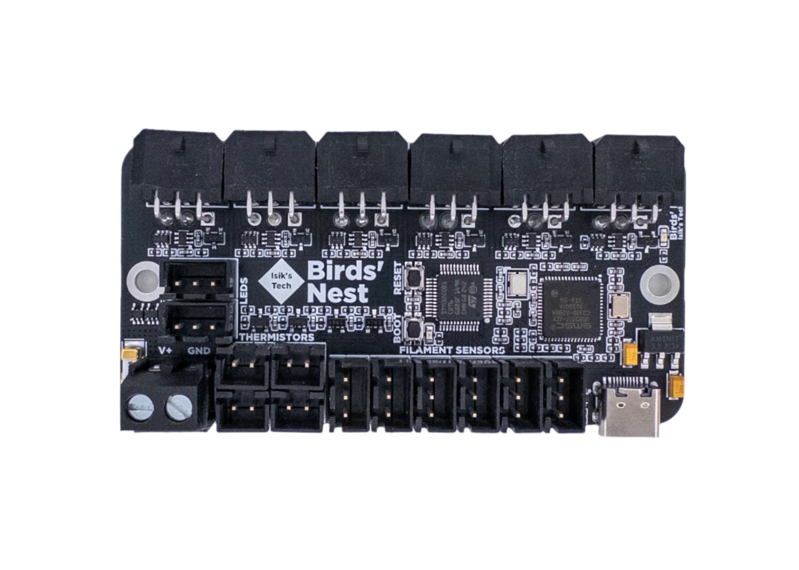

---
hide:
  - footer
---

# Birds' Nest Manual

## Introduction



Birds' Nest is a USB hub PCB designed for tool changers with USB toolhead PCBs. It features:

- 6x MX3.0 USB Toolhead Connectors with MOSFET and Diode Protections
- 1x Klipper MCU
- 6x 3-Pin Filament Sensor Connectors
- 4x Thermistor Connectors
- 2x 5V RGB LED Connectors

## Klipper Flashing

!!! info "If you sourced your PCB from an unofficial source, ensure nBOOT_SEL is set to enable BOOT0 before firmware flashing. Official Isik's Tech boards will already have this setting set so you can skip this step."

1. Connect the Birds' Nest to your Raspberry Pi using a USB cable.
2. Hold down the BOOT button. While holding it down, press the RESET button. Release RESET first, then BOOT. Birds' Nest should enter DFU mode.
3. SSH into your Raspberry Pi.
4. Use `lsusb` to make sure you can see the device in DFU mode.
5. Go to the Klipper directory. `cd klipper`
6. Clean remaining files from previous build. `make clean`
7. Choose the options for the build. `make menuconfig` Use the following options:

    ```
    [*] Enable extra low-level configuration options
        Micro-controller Architecture (STMicroelectronics STM32)  --->
        Processor model (STM32G0B1)  --->
        Bootloader offset (No bootloader)  --->
        Clock Reference (8 MHz crystal)  --->
        Communication interface (USB (on PA11/PA12))  --->
        USB ids  --->
    ()  GPIO pins to set at micro-controller startup
    ```

    Press `Q` then `Y` to save and quit the menu.

8. Build. `make`
9. Flash. `make flash FLASH_DEVICE=0483:df11`
10. When finished, press the RESET button on your Birds' Nest PCB.
11. Use `ls /dev/serial/by-id/*` to find the path starting with `/dev/serial/by-id/usb-Klipper_stm32g0b1`. This is the serial path of your Birds' Nest PCB.

## Next Steps

1. Install the PCB on your printer and do the wiring. Pinout can be found below.
2. Download the Klipper config file for Birds' Nest from the Birds' Nest GitHub repository: <https://github.com/xbst/Birds-Nest/tree/master/Firmware/nest.cfg>
3. Add the downloaded `nest.cfg` file to your printer's config directory.
4. Add `[include nest.cfg]` to your `printer.cfg`.
5. Restart Klipper. `FIRMWARE_RESTART`

## Pinout

{ type=application/pinout style="height:60vh;min-height:500px;width:100%" }

### Important Notes

- The maximum current Birds' Nest can supply to toolheads is 20A. If using high powered (60W+ for 24V) hotend heaters, turn the hotends on one by one. (Turn one on, when that reaches temp, then turn the next one on) The fuse cannot be replaced without soldering.
- The 5V for the Neopixels is supplied from the USB cable. They are intended to be used for a few LEDs and not LED strips. If planning to use LED strips, connect 5V and GND to the 5V PSU powering the Pi. Wagos on the Birds' Nest mount can be used for this. The signal can still come from the Birds' Nest.
- Pinouts can also be found on the back side of the PCB.

## Thanks

- Reth – USB Hub Idea & Beta Tester
- RChamp – USB Hub Idea & Beta Tester
- ThessienDSD - Beta Tester
- JDMontgomerySC.008 - Beta Tester
- Fr0stbyt3 - Beta Tester
- Nic335 - Beta Tester
- ManCheetah – Mount Designer
