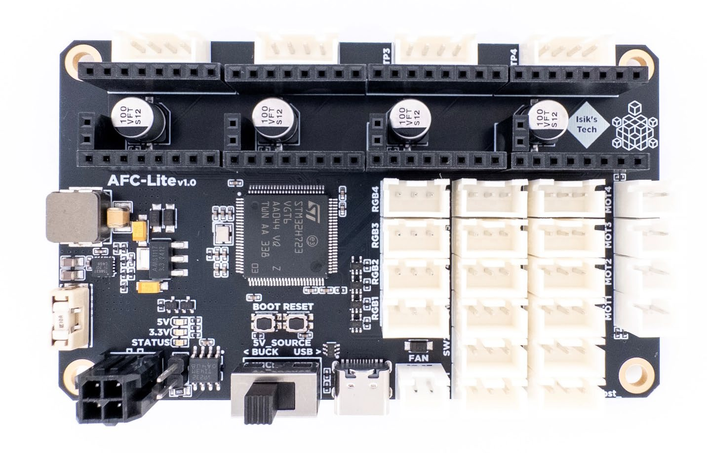

---
hide:
  - footer
---

# AFC-Lite Manual



## AFC-Lite Features

AFC-Lite is a controller PCB designed for Armored Turtle's Box Turtle multi-filament 3D printing system. It features:

- 4x Stepstick Slots for TMC2209-based Stepsticks
- 4x Brushed DC Motor Drivers
- 4x ARGB LED Connectors
- 12x Endstop Connectors
- 1x 5V Fan Connector (No Speed Control)
- STM32H723 MCU
- USB and CAN Support
- 5V Buck Converter

## Pinout

{ type=application/pinout style="height:60vh;min-height:500px;width:100%" }

## 5V_SOURCE Switch

This switch should be kept at the "BUCK" position during regular operation. Flipping this switch to "USB" makes MCU draw its power from the USB C cable, which can be useful for firmware flashing in certain scenarios (when there isn't a convenient 24V source). In this mode, the PCB won't be fully functional. Brushed motors and ARGB LEDs are wired to only draw power from the 5V buck converter on the PCB to not draw too much power from the USB C cable.

## Firmware Flashing (CAN with Katapult)

!!! warning "Do not put Cartographer v3 probes on the same CAN data lines as AFC-Lite. Using one of them in USB mode, or putting them on separate CAN networks is safe. This issue does not affect Cartographer v4 probes, just v3."

First of all, make sure CAN is already set up on your printer. You can follow Esoterical's guide here: <https://canbus.esoterical.online/>

1. Connect the AFC-Lite to CAN, power and USB, turn it on.
2. SSH into Pi.
3. Install Katapult using `git clone https://github.com/Arksine/katapult`.
4. Go to `~/klipper`, do a `make clean`, then `make menuconfig`, use the Klipper settings below, then `make`.
5. Go to the Katapult directory `cd ~/katapult/`, do a `make clean`, then `make menuconfig`, use the Katapult settings below, then `make`.
6. On the AFC-Lite, hold the BOOT button. While holding it press and release the RESET button, then release the BOOT button.
7. Use `lsusb` to verify that your AFC-Lite is in DFU mode.
8. Flash Katapult using `sudo dfu-util -a 0 -d 0483:df11 --dfuse-address 0x08000000:leave -D out/canboot.bin`.
9. Use `~/klippy-env/bin/python ~/klipper/scripts/canbus_query.py can0` to find AFC-Lite's UUID. It'll say Canboot next to it.
10. Flash Klipper using `cd ~/katapult/scripts && python3 flashtool.py -i can0 -f ~/klipper/out/klipper.bin -u <uuid>`, replace `<uuid>` with your AFC-Lite's UUID.

Klipper settings:

```
[*] Enable extra low-level configuration options
    Micro-controller Architecture (STMicroelectronics STM32)  --->
    Processor model (STM32H723)  --->
    Bootloader offset (128KiB bootloader)  --->
    Clock Reference (25 MHz crystal)  --->
    Communication interface (CAN bus (on PB8/PB9))  --->
(1000000) CAN bus speed
()  GPIO pins to set at micro-controller startup
```

Katapult settings:

```
    Micro-controller Architecture (STMicroelectronics STM32)  --->
    Processor model (STM32H723)  --->
    Build Katapult deployment application (Do not build)  --->
    Clock Reference (25 MHz crystal)  --->
    Communication interface (CAN bus (on PB8/PB9))  --->
    Application start offset (128KiB offset)  --->
(1000000) CAN bus speed
()  GPIO pins to set on bootloader entry
[*] Support bootloader entry on rapid double click of reset button
[ ] Enable bootloader entry on button (or gpio) state
[ ] Enable Status LED
```

## Firmware Flashing (USB)

1. Make sure 5V_SOURCE switch is flipped to "BUCK".
2. Connect the AFC-Lite to power and USB, turn it on.
3. SSH into Pi.
4. Go to `~/klipper`, do a `make clean`, then `make menuconfig`, use the settings below, then `make`.
5. On the AFC-Lite, hold the BOOT button. While holding it press and release the RESET button, then release the BOOT button.
6. Use `lsusb` to verify that your AFC-Lite is in DFU mode.
7. Flash Klipper using `make flash FLASH_DEVICE=0483:df11`.
8. Use `ls /dev/serial/by-id/*` to find your AFC-Lite's serial address.

```
[*] Enable extra low-level configuration options
    Micro-controller Architecture (STMicroelectronics STM32)  --->
    Processor model (STM32H723)  --->
    Bootloader offset (No bootloader)  --->
    Clock Reference (25 MHz crystal)  --->
    Communication interface (USB (on PA11/PA12))  --->
    USB ids  --->
()  GPIO pins to set at micro-controller startup
```

## Klipper Config

Klipper config and other software needed can be found on Armored Turtle's AFC Klipper Add-on GitHub repository: <https://github.com/ArmoredTurtle/AFC-Klipper-Add-On/>

## Troubleshooting

1. <u>Do I need to connect 24V and GND to the MX3.0 connector if I'm using USB?</u>

    Yes. The USB C connector is only used for data. You need to connect 24V power and GND to the MX3.0 connector even if you're not using CAN. Also, make sure the 5V_SOURCE switch is flipped to "BUCK".

2. <u>I'm able to connect to the PCB with USB but brushed motors and RGB LEDs aren't working.</u>

    Make sure to flip the 5V_SOURCE switch to "BUCK". If still not working, make sure 24V power and GND are connected to the MX3.0 connector and pins under the 5V_SOURCE switch aren't shorted.

3. <u>Klipper can't communicate with my SPI-based stepsticks.</u>

    AFC-Lite only fully supports UART stepsticks, like TMC2209s. You can use other stepsticks too, but only in STEP/DIR mode.

4. <u>[Insert CAN-related issue here]</u>

    Esoterical has a great CAN bus guide, I recommend checking it out for more information: <https://canbus.esoterical.online/>

5. <u>Do I need to use Katapult if using CAN?</u>

    No. However it makes firmware flashing much easier. To avoid confusion, this manual only covers CAN with Katapult.
