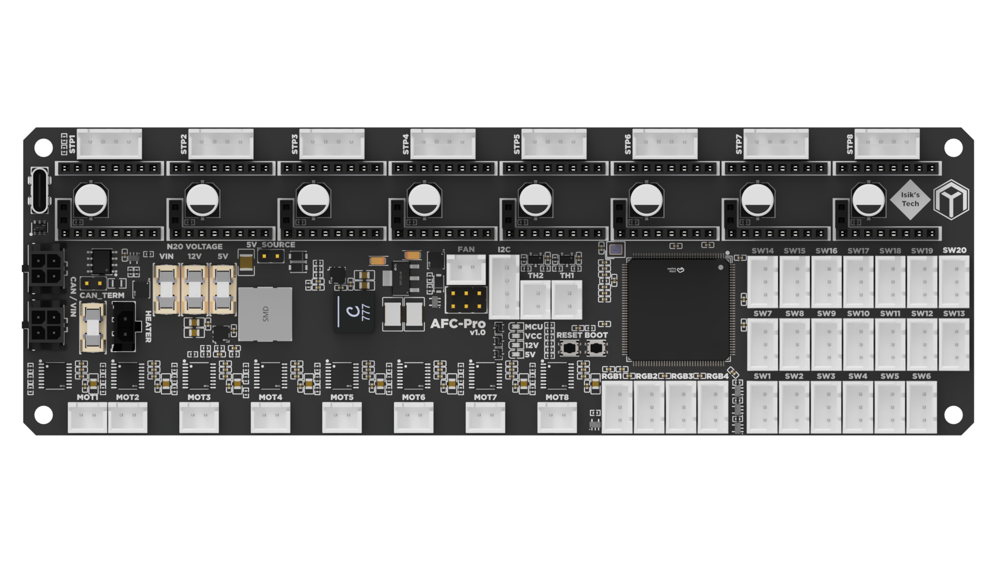

---
hide:
  - footer
---

# AFC-Pro Manual



## AFC-Pro Features

AFC-Pro is a controller PCB designed for Armored Turtle's Box Turtle AFC system. It features:

- 8x Stepstick Slots for TMC2209-based Stepsticks
- 8x Brushed DC Motor Drivers Supporting 5V, 12V and 24V Motors
- 4x ARGB LED Connectors
- 20x Switch Connectors
- 2x Thermistor Connectors
- I2C Connector for Chamber Sensors
- 1x VIN/12V/5V Fan Connector with Speed Control
- STM32H723 MCU
- USB and CAN Support with CAN Daisy Chaining Connector
- 12V & 5V Buck Converters

## Pinout

{ type=application/pinout style="height:60vh;min-height:500px;width:100%" }

## 5V_SOURCE Jumper

This jumper should not be populated during regular operation. Populating this jumper makes MCU draw its power from the USB C cable, which can be useful for firmware flashing in certain scenarios (when there isn't a convenient 24V source). In this mode, the PCB won't be fully functional. Brushed motors and ARGB LEDs are wired to only draw power from the 5V buck converter on the PCB to not draw too much power from the USB C cable.

## Advanced Brushed Motor Driver Features

AFC-Pro features DRV8876 brushed motor drivers with some extra features over the drivers used on AFC-Lite, currently not used by Box Turtles:

- Selectable 5V, 12V and 24V motor voltages
- Fault signal, letting the MCU know if something is not working as expected, like the motor stalling
- Analog motor current feedback pin to monitor motor power draw in software
- Increased 3A current capacity

## Setting Brushed Motor Voltage

AFC-Pro uses fuse holders to set the brushed motor voltage. By default, your AFC-Pro will come with a fuse populated in the 5V fuse holder, and no fuses in 12V and VIN fuse holders.

!!! warning "IMPORTANT"
    DO NOT POPULATE MORE THAN 1 N20 FUSE HOLDER WITH A FUSE.<br>
    DO NOT CHANGE THE FUSE POSITION WHEN THE BOARD IS POWERED.

Stock Box Turtle builds use 6V N20 motors, typically powered with 5V. Unless you know you need to use a different voltage, do not change the fuse location. Powering a motor with a higher voltage than it's rated for can damage the motor.

## Firmware Flashing (CAN with Katapult)

First of all, make sure CAN is already set up on your printer. You can follow Esoterical's guide here: <https://canbus.esoterical.online/>

1. Connect the AFC-Pro to CAN, power and USB, turn it on.
2. SSH into Pi.
3. Install Katapult using `git clone https://github.com/Arksine/katapult`.
4. Go to `~/klipper`, do a `make clean`, then `make menuconfig`, use the Klipper settings below, then `make`.
5. Go to the Katapult directory `cd ~/katapult/`, do a `make clean`, then `make menuconfig`, use the Katapult settings below, then `make`.
6. On the AFC-Pro, hold the BOOT button. While holding it press and release the RESET button, then release the BOOT button.
7. Use `lsusb` to verify that your AFC-Pro is in DFU mode.
8. Flash Katapult using `sudo dfu-util -a 0 -d 0483:df11 --dfuse-address 0x08000000:leave -D out/canboot.bin`.
9. Use `~/klippy-env/bin/python ~/klipper/scripts/canbus_query.py can0` to find AFC-Pro's UUID. It'll say Canboot next to it.
10. Flash Klipper using `cd ~/katapult/scripts && python3 flashtool.py -i can0 -f ~/klipper/out/klipper.bin -u <uuid>`, replace `<uuid>` with your AFC-Pro's UUID.

Klipper settings:

```
[*] Enable extra low-level configuration options
    Micro-controller Architecture (STMicroelectronics STM32)  --->
    Processor model (STM32H723)  --->
    Bootloader offset (128KiB bootloader)  --->
    Clock Reference (25 MHz crystal)  --->
    Communication interface (CAN bus (on PB8/PB9))  --->
(1000000) CAN bus speed
()  GPIO pins to set at micro-controller startup
```

Katapult settings:

```
    Micro-controller Architecture (STMicroelectronics STM32)  --->
    Processor model (STM32H723)  --->
    Build Katapult deployment application (Do not build)  --->
    Clock Reference (25 MHz crystal)  --->
    Communication interface (CAN bus (on PB8/PB9))  --->
    Application start offset (128KiB offset)  --->
(1000000) CAN bus speed
()  GPIO pins to set on bootloader entry
[*] Support bootloader entry on rapid double click of reset button
[ ] Enable bootloader entry on button (or gpio) state
[*] Enable Status LED
(PC10) Status LED GPIO Pin
```

## Firmware Flashing (USB)

1. Connect the AFC-Pro to power and USB, turn it on.
2. SSH into Pi.
3. Go to `~/klipper`, do a `make clean`, then `make menuconfig`, use the settings below, then `make`.
4. On the AFC-Pro, hold the BOOT button. While holding it press and release the RESET button, then release the BOOT button.
5. Use `lsusb` to verify that your AFC-Pro is in DFU mode.
6. Flash Klipper using `make flash FLASH_DEVICE=0483:df11`.
7. Use `ls /dev/serial/by-id/*` to find your AFC-Pro's serial address.

```
[*] Enable extra low-level configuration options
    Micro-controller Architecture (STMicroelectronics STM32)  --->
    Processor model (STM32H723)  --->
    Bootloader offset (No bootloader)  --->
    Clock Reference (25 MHz crystal)  --->
    Communication interface (USB (on PA11/PA12))  --->
    USB ids  --->
()  GPIO pins to set at micro-controller startup
```

## Klipper Config

Klipper config and other software needed can be found on Armored Turtle's AFC Klipper Add-on GitHub repository: <https://github.com/ArmoredTurtle/AFC-Klipper-Add-On/>

## Troubleshooting

For Box Turtle related help, you can find Armored Turtle's documentation here: <https://www.armoredturtle.xyz/docs/>

1. <u>Do I need to connect 24V and GND to the MX3.0 connector if I'm using USB?</u>

    Yes. The USB C connector is only used for data. You need to connect 24V power and GND to the MX3.0 connector even if you're not using CAN. Also, make sure the 5V_SOURCE jumper isn't populated.

2. <u>I'm able to connect to the PCB with USB but brushed motors and RGB LEDs aren't working.</u>

    Make sure the 5V_SOURCE jumper isn't populated.

3. <u>Klipper can't communicate with my SPI-based stepsticks.</u>

    AFC-Pro only fully supports UART stepsticks, like TMC2209s. You can use other stepsticks too, but only in STEP/DIR mode.

4. <u>[Insert CAN-related issue here]</u>

    Esoterical has a great CAN bus guide, I recommend checking it out for more information: <https://canbus.esoterical.online/>

5. <u>Do I need to use Katapult if I use CAN?</u>

    No. However, it makes firmware flashing much easier. To avoid confusion, this manual only covers CAN with Katapult.

6. <u>What are common stepper motor pinouts?</u>

    This depends on your specific stepstick, common pinouts are AABB and BAAB.

## Thanks

- Robert Klotz
- jimmyjon
- EricVA
- Trev1Ak
- Wondro
- Hdale
- Belial
- Moosaka
