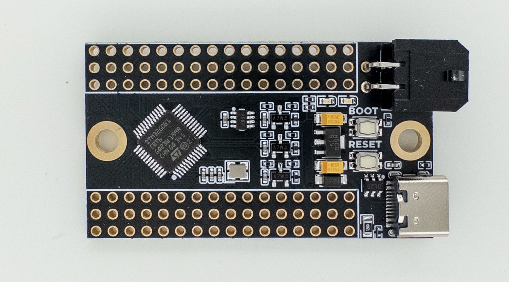
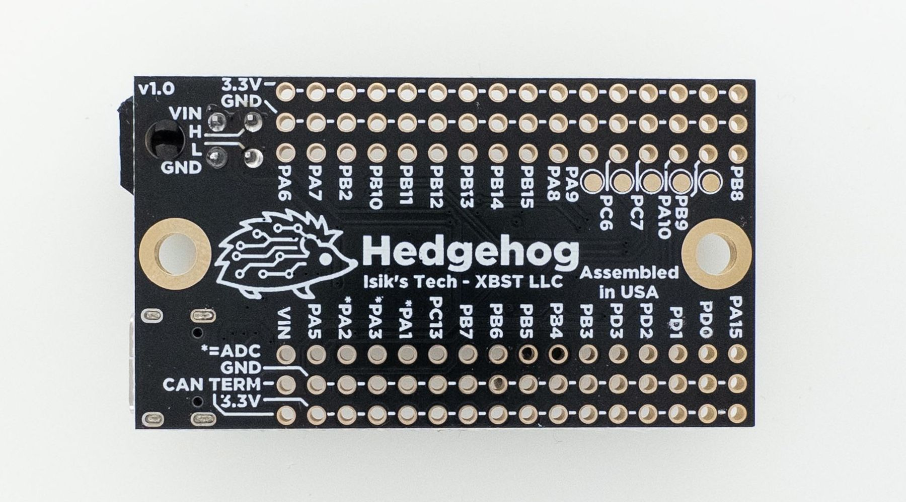
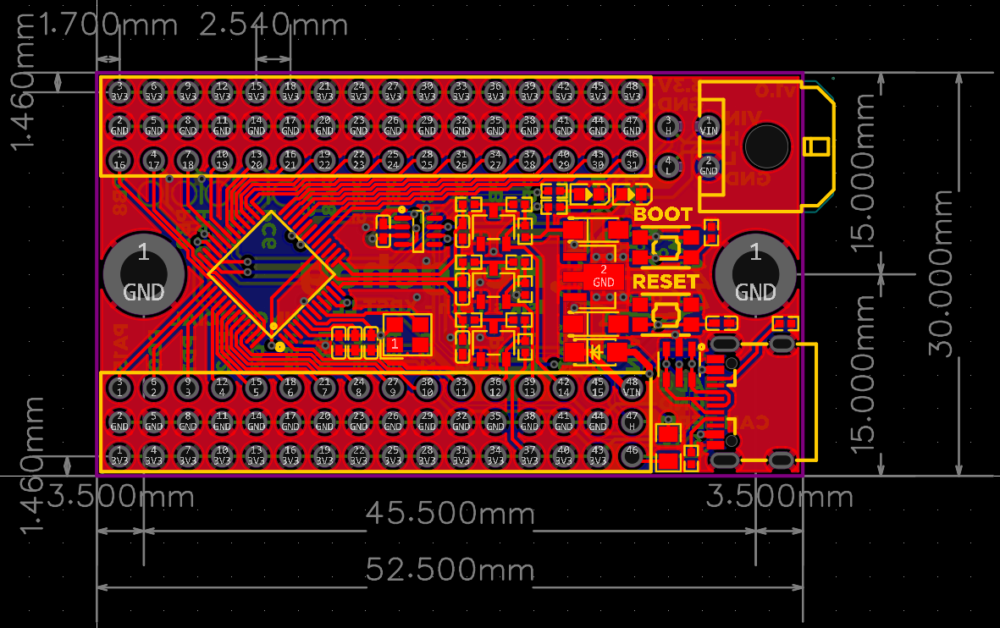

# Hedgehog Klipper IO Board


Hedgehog is a Klipper expansion PCB with 31 I/O pins, designed for cases when you just need a simple board to connect a few things to your printer, like pins for buttons, thermistors, I2C/SPI devices, etc. Hedgehog, unlike generic MCU breakout boards, is designed with ease-of-use with Klipper in mind:

- **Are you wiring a bunch of buttons and don't want to join many wires to one pin?** Hedgehog has a pair of 3.3V and GND for each pin.
- **Do you want to use CAN bus, and don't want to wire a separate CAN module?** Hedgehog has a CAN transceiver built-in, and supports both USB and CAN.
- **Do you only have 24V available where you're planning to place the board?** No problem, Hedgehog supports 24VIN.
- **Do you want to connect a few thermistors, and don't want to solder pullup resistors?** Hedgehog as pullups and protection for 3 thermistors built-in.
- **Are you designing a custom board for your application and need a simple MCU breakout board to slot into your design?** Hedgehog uses standard 2.54mm (0.1") pitch pin headers for its I/O, so you can easily slot it into standard female headers on your design.

Hedgehog uses a STM32G0B1 MCU, supporting Klipper, STM32Duino and many other firmwares.

[Store](https://store.isiks.tech/products/hedgehog)

## Klipper Setup

**Klipper Settings (USB)**

``````
[*] Enable extra low-level configuration options
    Micro-controller Architecture (STMicroelectronics STM32)  --->
    Processor model (STM32G0B1)  --->
    Bootloader offset (No bootloader)  --->
    Clock Reference (8 MHz crystal)  --->
    Communication interface (USB (on PA11/PA12))  --->
    USB ids  --->
[ ] Optimize stepper code for 'step on both edges'
()  GPIO pins to set at micro-controller startup
``````

**Klipper Settings (CAN with Katapult)**

``````
[*] Enable extra low-level configuration options
    Micro-controller Architecture (STMicroelectronics STM32)  --->
    Processor model (STM32G0B1)  --->
    Bootloader offset (8KiB bootloader)  --->
    Clock Reference (8 MHz crystal)  --->
    Communication interface (CAN bus (on PB0/PB1))  --->
(1000000) CAN bus speed
[ ] Optimize stepper code for 'step on both edges'
()  GPIO pins to set at micro-controller startup
``````

**Katapult Settings**

``````
    Micro-controller Architecture (STMicroelectronics STM32)  --->
    Processor model (STM32G0B1)  --->
    Build Katapult deployment application (Do not build)  --->
    Clock Reference (8 MHz crystal)  --->
    Communication interface (CAN bus (on PB0/PB1))  --->
    Application start offset (8KiB offset)  --->
(1000000) CAN bus speed
    Build Optimization Override (Size (-Os))  --->
()  GPIO pins to set on bootloader entry
[*] Support bootloader entry on rapid double click of reset button
[ ] Enable bootloader entry on button (or gpio) state
[*] Enable Status LED
(PA13)  Status LED GPIO Pin
``````

## Pinout



- "CAN TERM" pins are for terminating CAN bus. Populate a jumper across these pins to terminate CAN bus with a 120 ohm resistor.
- "VIN" pin can be used to supply the board with power, or to pass VIN power of the board to something else. 
- Pins marked with * feature a 4.7 kiloohm pull-up resistor and protection for thermistor applications. There are other ADC pins available which can be used for more thermistors, with the pull-up done externally.
- There are SPI and I2C pins available, refer to below table or STM32G0B1 datasheet for more info.

- Because the pins on this board don't have a pre-defined use case and can be used for anything, there's no Klipper config included in this document. 

| Pin  | ADC                         | Bus                                                          | HW Timer |
| ---- | --------------------------- | ------------------------------------------------------------ | -------- |
| PA6  | Yes - Not Pulled-Up         | -                                                            | -        |
| PA7  | Yes - Not Pulled-Up         | -                                                            | Yes      |
| PB2  | Yes - Not Pulled-Up         | SPI2 MISO (spi2_PB2_PB11_PB10)                               | -        |
| PB10 | Yes - Not Pulled-Up         | SPI2 SCK (spi2_PB2_PB11_PB10)<br />I2C2 SCL (i2c2_PB10_PB11) | Yes      |
| PB11 | Yes - Not Pulled-Up         | SPI2 MOSI (spi2_PB2_PB11_PB10)<br />I2C2 SDA (i2c2_PB10_PB11) | Yes      |
| PB12 | Yes - Not Pulled-Up         | -                                                            | -        |
| PB13 | -                           | SPI2 SCK (spi2_PB14_PB15_PB13)                               | -        |
| PB14 | -                           | SPI2 MISO (spi2_PB14_PB15_PB13)                              | Yes      |
| PB15 | -                           | SPI2 MOSI (spi2_PB14_PB15_PB13)                              | Yes      |
| PA8  | -                           | -                                                            | Yes      |
| PA9  | -                           | -                                                            | Yes      |
| PC6  | -                           | -                                                            | Yes      |
| PC7  | -                           | -                                                            | Yes      |
| PA10 | -                           | -                                                            | Yes      |
| PB9  | -                           | I2C1 SDA (i2c1_PB8_PB9)                                      | Yes      |
| PB8  | -                           | I2C1 SCL (i2c1_PB8_PB9)                                      | Yes      |
| PA15 | -                           | -                                                            | -        |
| PD0  | -                           | -                                                            | Yes      |
| PD1  | -                           | SPI - No Klipper Support                                     | Yes      |
| PD2  | -                           | SPI - No Klipper Support                                     | -        |
| PD3  | -                           | SPI - No Klipper Support                                     | -        |
| PB3  | -                           | SPI1 SCK (spi1_PB4_PB5_PB3)                                  | Yes      |
| PB4  | -                           | SPI1 MISO (spi1_PB4_PB5_PB3)                                 | Yes      |
| PB5  | -                           | SPI1 MOSI (spi1_PB4_PB5_PB3)                                 | Yes      |
| PB6  | -                           | -                                                            | Yes      |
| PB7  | -                           | -                                                            | -        |
| PC13 | -                           | -                                                            | -        |
| PA1  | Yes - Pulled-Up / Protected | -                                                            | -        |
| PA3  | Yes - Pulled-Up / Protected | -                                                            | -        |
| PA2  | Yes - Pulled-Up / Protected | -                                                            | -        |
| PA5  | Yes - Not Pulled-Up         | -                                                            | Yes      |

## Designing Custom PCBs with Hedgehog

One of the potential use cases for Hedgehog is designing your own Klipper PCB for your own project with Hedgehog as its MCU, similar to how you might use an Pi Pico for this purpose, but with Hedgehog's Klipper-specific features like 24VIN, CAN and thermistor protection. Designing your PCB with Hedgehog simplifies the design work needed for your project, lowers the barrier to entry and assembly costs.

Below is the board outline and locations of the IO pins of Hedgehog. Hedgehog uses standard 2.54mm (0.1") pitch pin headers, so you can use standard female sockets on your PCB, or use pin headers and solder it in place.



## Source Files

~~Hedgehog source files can be found on [Github](https://github.com/xbst/Hedgehog). It's licensed under a
[Creative Commons Attribution-NonCommercial-ShareAlike 4.0 International License][cc-by-nc-sa].~~ **Coming soon**

[![CC BY-NC-SA 4.0][cc-by-nc-sa-image]][cc-by-nc-sa]

[cc-by-nc-sa]: http://creativecommons.org/licenses/by-nc-sa/4.0/
[cc-by-nc-sa-image]: https://licensebuttons.net/l/by-nc-sa/4.0/88x31.png
[cc-by-nc-sa-shield]: https://img.shields.io/badge/License-CC%20BY--NC--SA%204.0-lightgrey.svg

