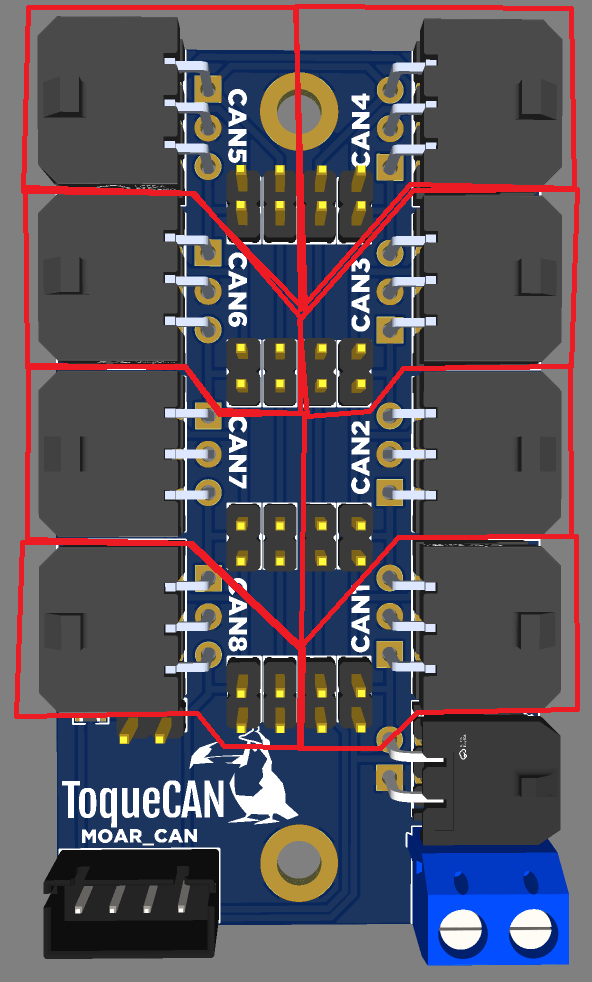
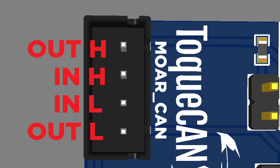
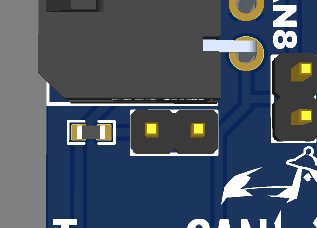
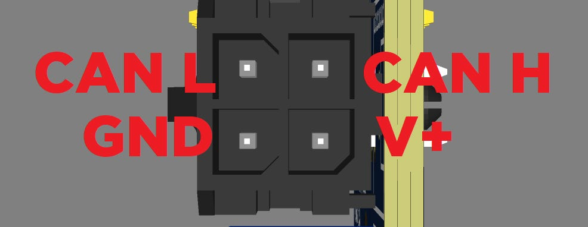
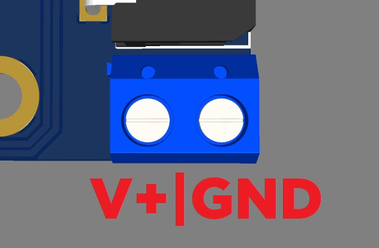

---
hide:
  - footer
---

# MOAR_CAN Manual

MOAR_CAN is a CAN bus hub designed for IDEX printers, toolchangers and other 3D printer applications where multiple CAN devices need to be connected together. Unlike most 3D printer CAN bus hubs on the market, MOAR_CAN is designed to follow a linear bus topology with short stub lengths. 1Mbit CAN bus standard (ISO 11898) recommends a maximum bus length of 40 meters, with a maximum of 30 nodes (CAN devices) and a <u>maximum stub length of 300mm</u>, with 120-ohm termination resistors on both ends of the bus.

## CAN Bus Topology

Most CAN bus hub PCBs on the market use a very short linear bus (the trace length on the PCB + the length of the wires from the USB to CAN adapter), with the toolhead connectors acting as stubs. As stated earlier, the maximum recommended stub length is 300mm, but the cable run to the toolhead is likely much longer than that. This means, while these CAN hub PCBs may work, they don't follow the recommended topology, meaning CAN bus-related problems like communication errors are more likely to happen.

MOAR_CAN is designed to keep the stub length as short as possible, and requires a longer bus to follow the recommended specs as closely as possible. This requires the CAN bus to go to the toolhead (or other CAN device) and come back from there. The longer bus is not a problem, since up to 40 meters of bus length is within the recommended specs.

You can explore both approaches in the interactive simulator below. Add or remove toolheads, switch a toolhead between 6-wire and 4-wire cabling, move the 120-ohm termination jumpers, and toggle the bypass jumpers behind each port to see how the bus and the signals on it react. The "Typical 4-wire hub" preset shows how most hubs on the market are wired; the "Recommended 6-wire" preset shows how MOAR_CAN is meant to be wired. The termination can be on the hub or on the last CAN device — try the "Last toolhead terminated" preset.

{ type=application/pinout style="height:80vh;min-height:700px;width:100%" }

With this design, the bus wires go to the nodes, and come back, with the hub just joining the wires coming from one node with the wires going to the next node. On the CAN node (like toolhead PCB), the 2 pairs of CAN wires are joined together on the CAN connector, effectively making it a long linear bus. The stub length ends up being the distance of wires (mostly PCB traces) between the connector and the CAN transceiver on the PCB, usually low double-digit millimeters.

## Cabling

Both twisted pairs can be in the same cable. On the hub end, you use a 6-pin MX3.0 2x3 connector, and on the device end, you use a 4-pin connector, like MX3.0 2x2 or XT30(2+2). The 2 wires for CAN H and L get joined in the same crimp pin.

This, of course, means that you need to run more wires to your CAN devices.

There are some 6 wire cables with 2 thick conductors (for power) and 2 pairs of thinner twisted wires (the in and out CAN wires) on the market, like IGUS Chainflex CF113-018-D. These cables are usually designed for servo motors in industrial applications, but they are also suitable for this use case.

The IGUS cable mentioned above can be purchased from Isik's Tech here:

[https://store.isiks.tech/products/can-cable](https://store.isiks.tech/products/can-cable)

## 6-Pin MX3.0 Connector

This is the pinout of the 6-pin MX3.0 connector on the MOAR_CAN:

As you can see, the outer pins are for the CAN bus. A pair of wires should run from 1 side of the connector on the MOAR_CAN to the connector on the CAN device. On the connector on the CAN device, the other pair of CAN wires should be joined to the CAN wires running from the MOAR_CAN, and they should run back to the other side of the connector on the MOAR_CAN.

If a 6-pin connector is not going to be used, the pin headers behind it needs to have jumpers populated. These jumpers connect the CAN pins on both sides of the connector together.

## MOAR_CAN Connector

The CAN wires from your USB/CAN adapter (PiCAN, ToqueCAN, etc.) can be connected to the MOAR_CAN using the XH2.54 MOAR_CAN connector, or the MX3.0 2x2 connector (more about this connector later).

The MOAR_CAN connector has pins for both ends of the CAN bus on the MOAR_CAN. This ensures compatibility with ToqueCANs. For non-ToqueCAN applications, the inner pair of pins should be used. For ToqueCANs, use all 4 pins, and make sure the pinouts on both ends of the cable are the same. Each pair of CAN wires should be twisted.

MOAR_CAN connector pinout:

## 120-Ohm Termination Jumper

There is a 120-Ohm CAN termination jumper on the PCB as well. This should not be populated if using the MOAR_CAN with a ToqueCAN. It should not be populated if the last CAN device connected to the MOAR_CAN is terminated either. If the last CAN device connected to the MOAR_CAN does not have the 120-Ohm CAN termination, then a jumper should be connected, so the CAN bus has termination on both ends of the bus.

Your USB/CAN adapter should also be terminated, except when using a ToqueCAN. With a ToqueCAN, the 2 CAN devices connected to the ToqueCAN should be terminated.

120-Ohm Termination Jumper:

## 4-Pin MX3.0 Connector

This is the pinout of the 4-pin MX3.0 connector on the MOAR_CAN:

Please pay attention to this pinout and double check if your cable has the same pinout, as this is not the same as the ToqueCAN or other CAN devices with the same connector.

This connector can be used for a few different use cases.

You can use this connector as the CAN bus in connector instead of the XH2.54 connector if you are using a non-ToqueCAN USB/CAN adapter. You can also use it to supply power to the PCB in this case, but please keep in mind the maximum current the MX3.0 connector is rated for is 10.5A, or about 250W if you are using a 24V system. Do not use this connector for power if you are going to use the MOAR_CAN to deliver power to devices consuming more power than this, like multiple toolhead PCBs.

If you are using a non-ToqueCAN USB/CAN adapter, and use the MOAR_CAN connector as described above, you can use this connector for an auxiliary CAN device, if the stub length (cable length) is short enough. Up to 250mm should be ok.

If you are using a non-ToqueCAN USB/CAN adapter, and you want to use this connector for a CAN device, but you need a longer-than-250mm cable going to the CAN device, you can use the outer pins of the MOAR_CAN connector instead. In this case, this CAN device needs to have the 120-Ohm termination, and the 120-Ohm termination on the MOAR_CAN cannot be used. Your USB/CAN adapter also needs the 120-Ohm termination, and no other CAN device connected to the MOAR_CAN can have the 120-Ohm termination.

## Power Input

This is the pinout of the screw terminal block:

This connector is for the power input. The maximum total current the MOAR_CAN can supply to all devices connected to it is 24A, and the maximum current the MOAR_CAN can supply to a device connected to it is 10.5A. Please do not use the MOAR_CAN to deliver more power than these ratings.
