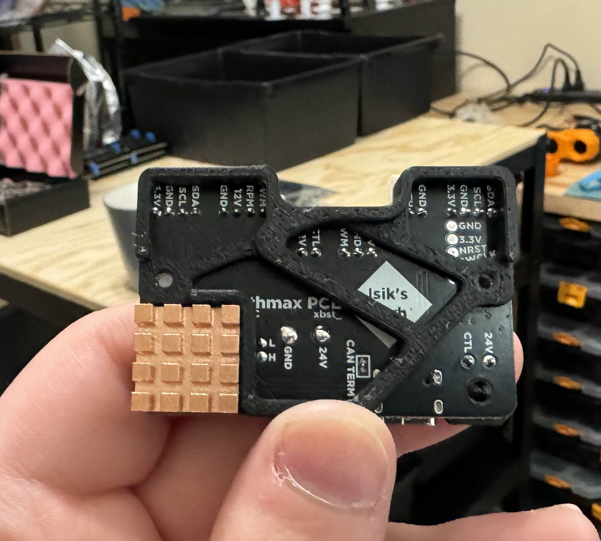
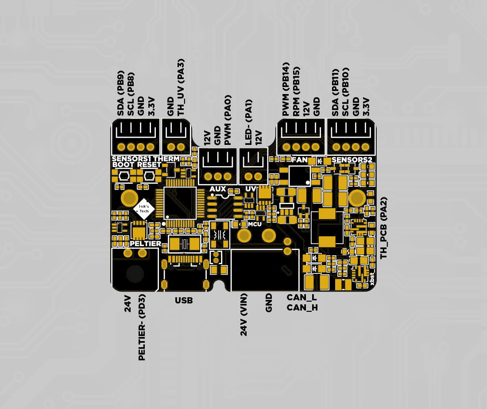
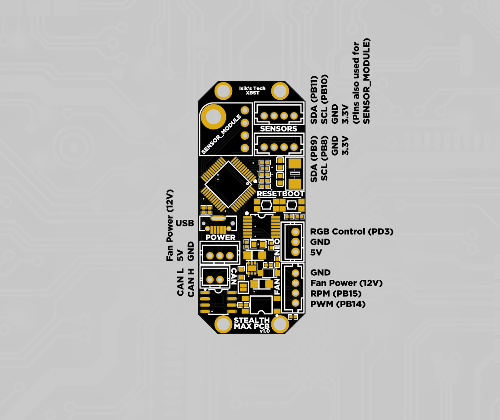
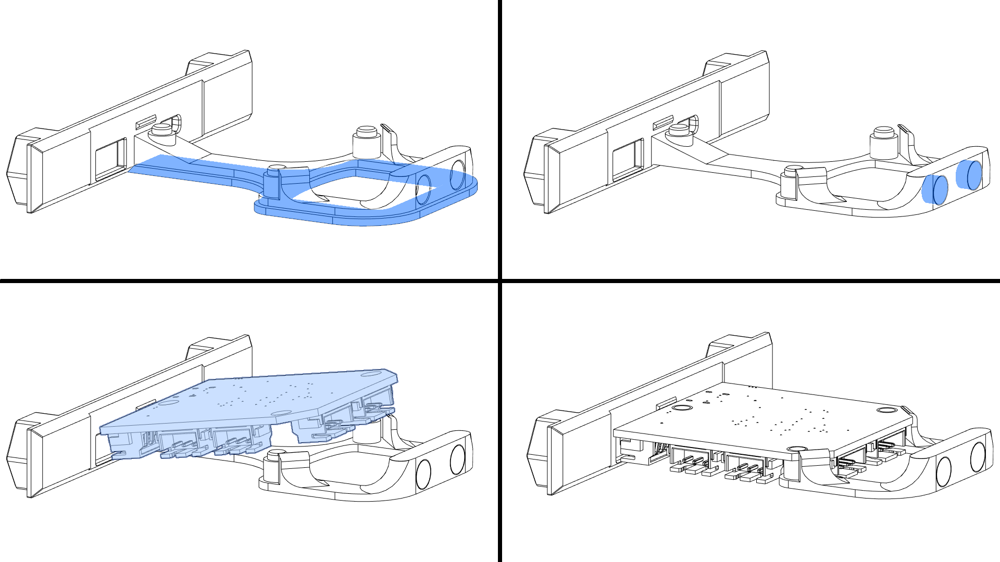
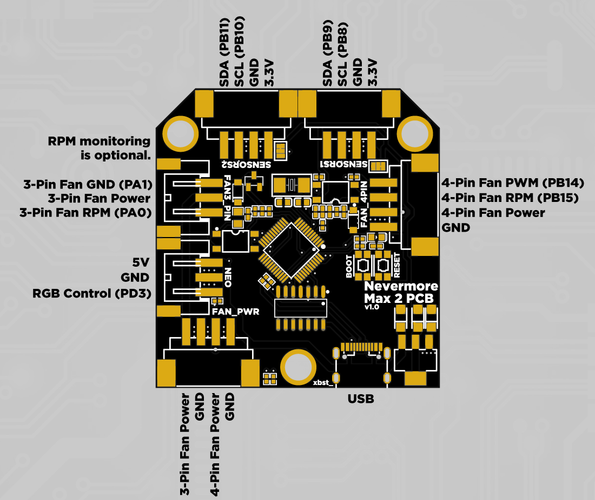

---
hide:
  - footer
---

# Nevermore PCBs

<style type="text/css">
.tg  {border-collapse:collapse;border-spacing:0;}
.tg td{border-color:grey;border-style:solid;border-width:0.5px;overflow:hidden;padding:6px 6px;word-break:normal;text-align:left;vertical-align:center}
.tg th{border-color:grey;border-style:solid;border-width:0.5px;overflow:hidden;padding:6px 6px;word-break:normal;text-align:center;vertical-align:center}
</style>
<table class="tg">
  <thead>
    <tr>
      <th></th>
      <th>Nevermore Max 2 PCB</th>
      <th>Nevermore Mini & Stealthmax PCB</th>
      <th>Nevermore Stealthmax PCB 2</th>
      <th>Nevermore Stealthmax PCB 3</th>
    </tr>
  </thead>
  <tbody>
    <tr>
      <th></th>
      <td></td>
      <td></td>
      <td></td>
      <td></td>
    </tr>
    <tr>
      <th>MCU</th>
      <td>STM32G0B1</td>
      <td>STM32G0B1</td>
      <td>STM32G0B1</td>
      <td>STM32G0B1</td>
    </tr>
    <tr>
      <th>Sensors</th>
      <td>2x HW I2C</td>
      <td>2x HW I2C<br>1x Optional Sensor Module Mount</td>
      <td>2x HW I2C</td>
      <td>2x HW I2C</td>
    </tr>
    <tr>
      <th>Fan Control</th>
      <td>1x 4-pin, VIN<br>1x 3/2-pin, VIN</td>
      <td>1x 4-pin, VIN</td>
      <td>1x 4-pin, 12V</td>
      <td>1x 4-pin, VIN</td>
    </tr>
    <tr>
      <th>Peltier Control</th>
      <td>-</td>
      <td>-</td>
      <td>1x MOSFET</td>
      <td>1x MOSFET</td>
    </tr>
    <tr>
      <th>Servo Control</th>
      <td>-</td>
      <td>-</td>
      <td>-</td>
      <td>1x Port, 5V</td>
    </tr>
    <tr>
      <th>UV LED Control</th>
      <td>-</td>
      <td>-</td>
      <td>1x MOSFET<br>1x PWM</td>
      <td>1x Constant Current</td>
    </tr>
    <tr>
      <th>ARGB LED Control</th>
      <td>1x Port</td>
      <td>1x Port</td>
      <td>-</td>
      <td>1x Port</td>
    </tr>
    <tr>
      <th>Thermistors</th>
      <td>-</td>
      <td>-</td>
      <td>1x On-PCB 3950<br>1x Port</td>
      <td>1x On-PCB 3950<br>3x Port</td>
    </tr>
    <tr>
      <th>CAN Bus</th>
      <td>-</td>
      <td>Yes</td>
      <td>Yes</td>
      <td>Yes</td>
    </tr>
    <tr>
      <th>VIN</th>
      <td>12-24V</td>
      <td>12-24V</td>
      <td>24V</td>
      <td>12-24V</td>
    </tr>
    <tr>
      <th>12V Rail</th>
      <td>-</td>
      <td>-</td>
      <td>5A</td>
      <td>-</td>
    </tr>
    <tr>
      <th>5V Rail</th>
      <td>From USB</td>
      <td>From USB or external supply</td>
      <td>From USB or regulated from VIN</td>
      <td>From USB or regulated from VIN</td>
    </tr>
    <tr>
      <th>3.3V Rail</th>
      <td>Onboard LDO</td>
      <td>Onboard LDO</td>
      <td>Onboard LDO</td>
      <td>Onboard LDO</td>
    </tr>
    <tr>
      <th>Connectors</th>
      <td>XH, USB C</td>
      <td>PH, USB Micro B</td>
      <td>PH, USB C, XT30(2+2), MX3.0</td>
      <td>PH, USB C, MX3.0</td>
    </tr>
  </tbody>
</table>

<br>PCBs for Nevermore Mini, Nevermore Max and Nevermore Stealthmax air filters. 
<br>More information about the Nevermore Max 2 air filter can be found [here](https://github.com/nevermore3d/Nevermore_Max)
<br>More information about the Nevermore Stealthmax air filter can be found [here](https://github.com/nevermore3d/StealthMax)
<br>More information about the Nevermore Mini air filter can be found [here](https://www.printables.com/model/757663-nevermore-mini-3d-printer-hepa-and-carbon-air-filt).


## Resellers
To be updated after Stealthmax PCB 3 release.


## Firmware Flashing

!!! warning "Do not hot-plug VIN on your PCB. Always turn your printer off before plugging/unplugging the VIN cable."

!!! info "If you sourced your PCB from an unofficial source, ensure nBOOT_SEL is set to enable BOOT0 before firmware flashing. Official Isik's Tech boards will already have this setting set so you can skip this step."

1. SSH into your Klipper SBC (Raspberry Pi).
2. Connect your PCB with a USB cablw
3. Hold down the `BOOT` button on your PCB. While holding it down, press `RESET`, then release `BOOT`. Alternatively, you can unplug the PCB then plug it in again while holding down the `BOOT` button. Use `lsusb` again to make sure you can see the device in DFU mode.
4. Go to the Klipper directory. `cd klipper`
5. Clean remaining files from previous build. `make clean`
6. Choose the options for the build. `make menuconfig` Use the following options:

??? info "USB Serial Communication"
    ```
    [*] Enable extra low-level configuration options
        Micro-controller Architecture (STMicroelectronics STM32)  --->
        Processor model (STM32G0B1)  --->
        Bootloader offset (No bootloader)  --->
        Clock Reference (8 MHz crystal)  --->
        Communication interface (USB (on PA11/PA12))  --->
        USB ids  --->
    ()  GPIO pins to set at micro-controller startup
    ```
??? info "CAN Bus Communication (with Katapult)"
    This option is not available for Nevermore Max 2 PCB.
    ```
    [*] Enable extra low-level configuration options
        Micro-controller Architecture (STMicroelectronics STM32)  --->
        Processor model (STM32G0B1)  --->
        Bootloader offset (8KiB Bootloader)  --->
        Clock Reference (8 MHz crystal)  --->
        Communication interface (CAN bus (on PB0/PB1))  --->
    (1000000) CAN bus speed
    ()  GPIO pins to set at micro-controller startup
    ```
Press `Q` then `Y` to save and quit the menu.

7. Build. `make`
8. Flash firmware:

??? info "USB Serial Communication"
    1. Flash Klipper. `make flash FLASH_DEVICE=0483:df11`
    2. When finished, press the `RESET` button on your Nevermore Stealthmax PCB.
    3. Use  `ls /dev/serial/by-id/*` to find the path starting with `/dev/serial/by-id/usb-Klipper_stm32g0b1`. This is the serial path of your Nevermore Stealthmax PCB.

??? info "CAN Bus Communication (with Katapult)"
    1. Go home. `cd ~`
    2. Install [Katapult](https://github.com/Arksine/katapult). `git clone https://github.com/Arksine/katapult`
    3. Go to the Katapult directory. `cd katapult`
    4. Choose the options for the build. `make menuconfig` Use the following options:
    ```
        Micro-controller Architecture (STMicroelectronics STM32)  --->
        Processor model (STM32G0B1)  --->
        Build Katapult deployment application (Do not build)  --->
        Clock Reference (8 MHz crystal)  --->
        Communication interface (CAN bus (on PB0/PB1))  --->
        Application start offset (8KiB offset)  --->
    (1000000) CAN bus speed
    ()  GPIO pins to set on bootloader entry
    [*] Support bootloader entry on rapid double click of reset button
    [ ] Enable bootloader entry on button (or gpio) state
    [*] Enable Status LED
    (PA13)  Status LED GPIO Pin
    ```
    5. Build. `make`<br>
    6. Flash Katapult. `sudo dfu-util -a 0 -d 0483:df11 --dfuse-address 0x08000000:leave -D out/canboot.bin`
    7. Power down your system (DO NOT HOT PLUG), connect your VIN and CAN cable, disconnect USB, power your system on and SSH into your SBC.
    8. Use  `~/klippy-env/bin/python ~/klipper/scripts/canbus_query.py can0` to find the CAN bus UUID of your Nevermore Stealthmax PCB. (Make sure your CAN wires are connected.)
    9. Flash Klipper. Replace `<UUID>` with your PCB's UUID. `cd ~/katapult/scripts && python3 flashtool.py -i can0 -f ~/klipper/out/klipper.bin -u <uuid>`
    10. When finished, press the `RESET` button on your Nevermore Stealthmax PCB.

## SGP40 Plugin Installation
!!! info "Klipper I2C Changes"
    Klipper devs are currently frequently making changes to the I2C code, and Kalico is merging these changes shortly after. These changes occasionally break compatibility with the SGP40 plugin until its dev updates the plugin. It's recommended to NOT update Klipper/Kalico until Klipper I2C changes are finalized. Updated April 2026.
1. SSH into your Klipper SBC (Raspberry Pi) and run these commands:
```sh
cd ~
git clone https://github.com/thetic/klipper-sgp40.git
cd klipper-sgp40
./install.sh
```
2. Add the following to your `moonraker.conf` to enable automatic updates:
```ini
[update_manager klipper-sgp40]
type: git_repo
path: ~/klipper-sgp40
origin: https://github.com/thetic/klipper-sgp40.git
primary_branch: main
managed_services: klipper
```
## PCB Mount & Wiring
### Nevermore Stealthmax PCB 2
1. Download and print the necessary files from the PCB's repo. You'll need to at least print the "Spacer" for your printer size. You can use the stock latch with the Rasperry Pi logo, or download the version from this repo with the Isik's Tech logo.

|Filter      |Spacer|Latch|
|------------|---|-----|
|Stealthmax  |[Spacer](https://github.com/xbst/Nevermore-PCB/Mounts/Stealthmax/Spacer.stl)|[Latch](https://github.com/xbst/Nevermore-PCB/Mounts/Stealthmax/Latch.stl)|
|Stealthmax S|[Spacer](https://github.com/xbst/Nevermore-PCB/Mounts/Stealthmax-S/Spacer.stl)|[Latch](https://github.com/xbst/Nevermore-PCB/Mounts/Stealthmax-S/Latch.stl)|

2. Place the spacer over the screw holes of the electronics chamber of your filter. The top side of the mount (printing orientation), faces down. Align the outer screw holes with the holes on the spacer.
3. Attach the heatsink to the PCB, behind the corner with the buck converters. Align its edges with the edges of the PCB. This is where it fits with the spacer:

4. Do the wiring. All internal connectors except peltier are JST-PH, peltier is MX3.0. CAN/VIN connector is XT30(2+2). Use the diagram below to wire your fan/sensors/leds/thermistor/peltier.

!!! warning "Do not hot-plug VIN on your PCB. Always turn your printer off before plugging/unplugging the VIN cable."
### Nevermore Mini & Stealthmax PCB
1. Mount the PCB where the Raspberry Pi Pico normally mounts with M2 screws.
2. All connectors except USB are JST-PH. Use the diagram below to wire your fans/sensors/CAN/power.

### Nevermore Max 2 PCB
1. Print the ~~bottle opener~~ [Nevermore Max PCB tray](https://github.com/xbst/Nevermore-PCB/Mounts/Max/PCB-Tray.stl) using the standard Voron print settings.
2. Remove the built-in supports.
3. Superglue 2 magnets. Pay attention to the polarities.
4. Mount the PCB. The plastic latches will keep the PCB in place, no screws needed. The USB/power side should be seated first.

5. All connectors except USB are JST-XH. Use the diagram below to wire your fans/sensors/leds/power.

## Klipper Config
1. Download the Klipper config, and upload it to your printer.
2. Open the file and edit according to your setup.
3. Add `[include <name>.cfg]` in your `printer.cfg`. (replace `<name>` with the name of the file)


| Nevermore Max 2 PCB | Nevermore Mini & Stealthmax PCB | Nevermore Stealthmax PCB 2 |
|---|---|---|
| [Config](https://raw.githubusercontent.com/xbst/Nevermore-PCB/refs/heads/master/Firmware/Max.cfg) | [Config](https://raw.githubusercontent.com/xbst/Nevermore-PCB/refs/heads/master/Firmware/Max.cfg) | [Config](https://raw.githubusercontent.com/xbst/Nevermore-PCB/refs/heads/master/Firmware/SM2.cfg) |
