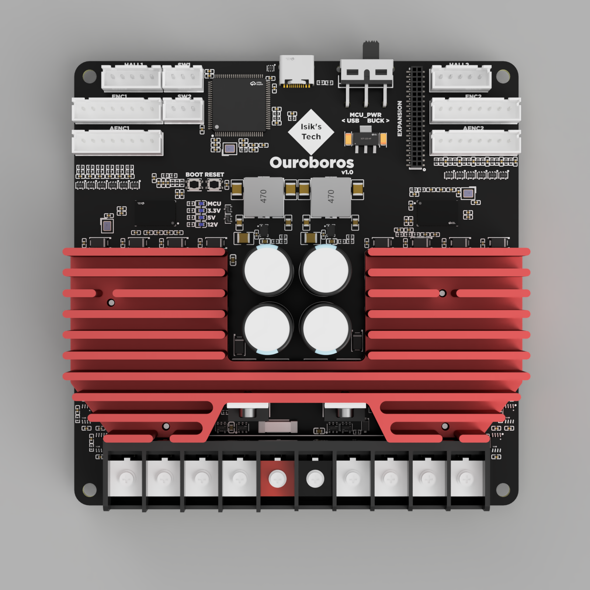
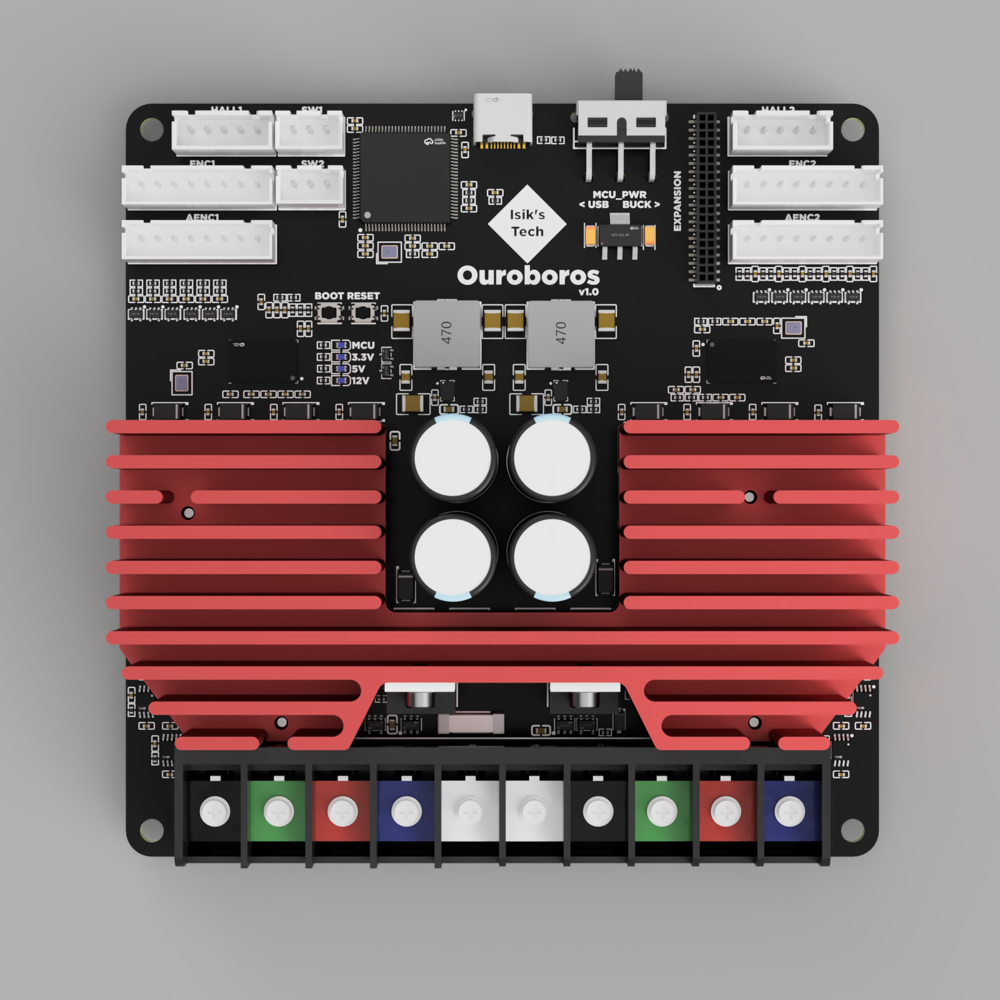
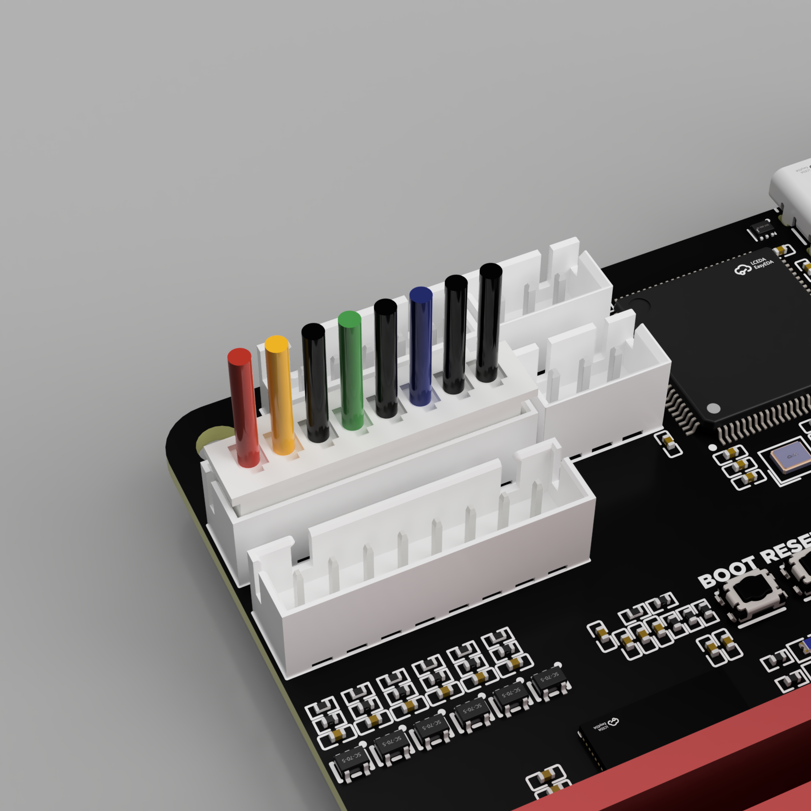
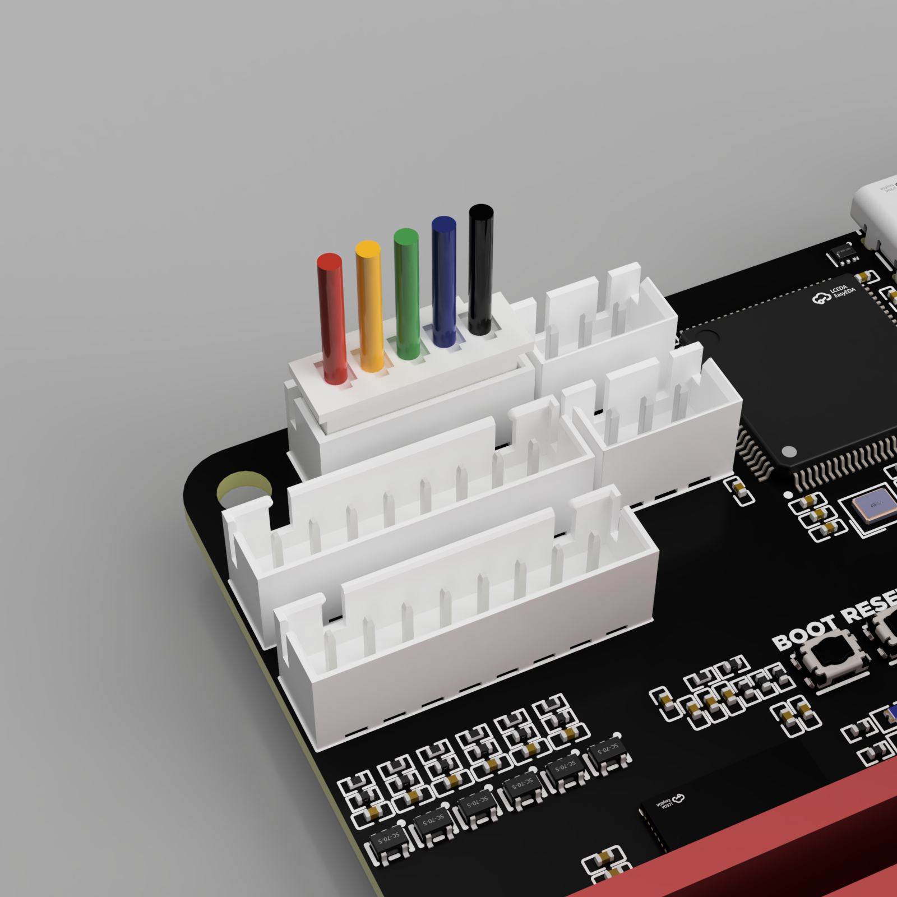
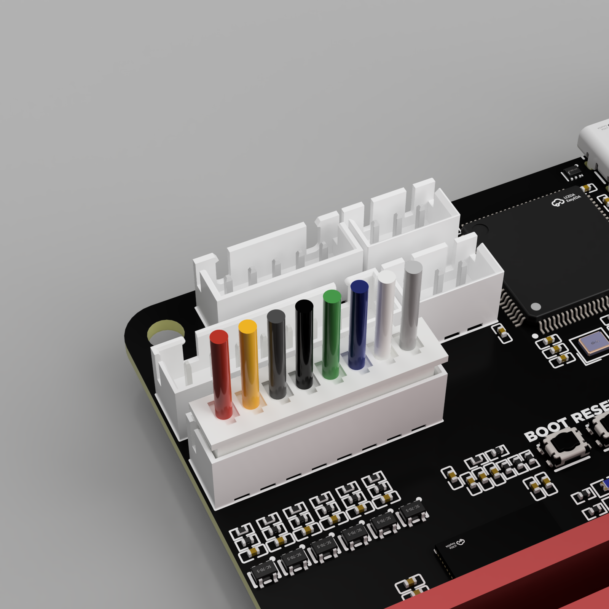
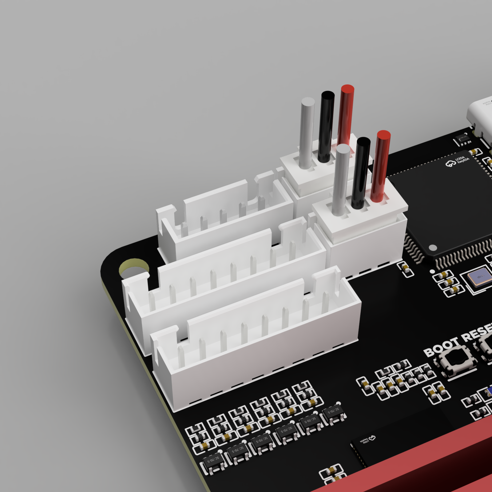
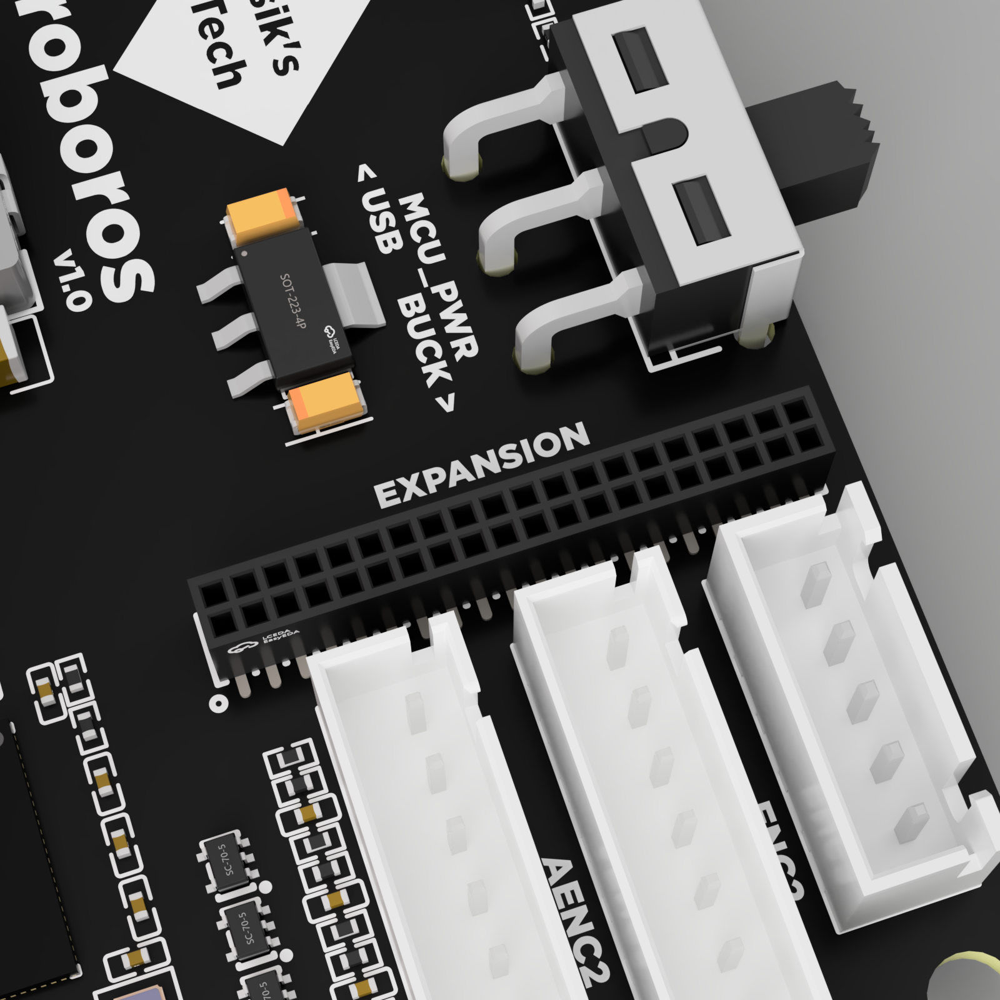

# Ouroboros Wiring & Mount

## Ouroboros Mounts
**To be added** (refer to the repo)

## Ouroboros Wiring

### Power In

Motor power (24V-60V) can be connected to the Ouroboros using the middle 2 pins on its screw terminal.

| Red  | Black |
| ---- | ----- |
| +    | -     |

### USB

Connect the USB cable coming from your Klipper SBC to the USB C port. Make sure to use a USB C cable supporting data.

Make sure the `MCU_PWR` switch is set to `BUCK`. This switch is meant to be set to `BUCK` during normal operation. The `USB` setting is for firmware flashing without power connected to VIN. You won't need this setting when following this documentation.

### Motor Power Wires

!!! note "Note"
    There's no standard for motor wire colors, so your motor wire colors may differ. Make sure to refer to the pinout below to make sure your motors are wired correctly.

#### Stepper Motor Power

Refer to your stepper motor's datasheet to find its wire colors for each coil. It will look similar to the image on the right. 

It's also possible to figure out which wires are on the same coil by using a multimeter. However, later on you'll need access to other information on your stepper motor's datasheet for calibrating your Ouroboros, so you need the datasheet anyway.

Wire one coil to the connector highlighted in black and green, the other to red and blue. Repeat for both motors.

| Black | Green | Red  | Blue |
| ----- | ----- | ---- | ---- |
| A1    | A2    | B1   | B2   |
| A     | C     | B    | D    |

#### Brushless DC (BLDC) Motor Power

Wire the 3 wires to black, green and red highlighted connectors. Do not wire anything to the blue highlighted connector. Below is a wiring example. Repeat for both motors.

| Black | Green | Red  | Blue |
| ----- | ----- | ---- | ---- |
| U     | V     | W    | -    |

### Encoder

!!! note "Note"
    Recommended encoder type is AB or ABZ optical encoder. Hall effect encoders are known to not work as well.

#### AB & ABZ Optical Encoders

Refer to your motor's (or encoder's) datasheet to find the wire colors of the encoder.

The GND pins between the A,B,Z pins were added for wiring convenience. The negative encoder pins are meant to be wired to GND, and only the positive pins are used connected to TMC4671.

If your encoder doesn't have Z wires (AB encoders), you can skip those wires.

Repeat for both motors.

**Pinout**

| Red  | Yellow | Black    | Green  | Black    | Blue   | Black    | Black |
| ---- | ------ | -------- | ------ | -------- | ------ | -------- | ----- |
| 5V   | Z (Z+) | GND (Z-) | B (B+) | GND (B-) | A (A+) | GND (A-) | GND   |

#### Hall Effect Encoders

**Pinout**

| Red  | Yellow | Green | Blue | Black |
| ---- | ------ | ----- | ---- | ----- |
| 5V   | YW     | V     | UX   | GND   |

#### Analog Encoders

**Pinout**

| Red  | Yellow | Dark Grey | Black | Green | Blue | White | Light Grey |
| ---- | ------ | ----- | ----- | ----- | ---- | ----- | ----- |
| 5V   | YW+    | YW-   | VN+   | VN-   | UX+  | UX-   | GND   |

### Endstop Connector

**Pinout**

| Grey             | Black | Red  |
| ---------------- | ----- | ---- |
| Switch (PD7/PB3) | GND   | 3.3V |

### Expansion Connector

This connector is designed for adding more features to Ouroboros. It has some power pins, and many pins connectors connected to the STM32 MCU, including CAN bus, UART, and other GPIO pins. It's a standard 1.27mm pitch female header, which can be mated with a standard 1.27mm pin header on an expansion board, or with male jumper wires using the same size connector.

Currently there are no official expansion boards available.

<table class="tg"><thead>
  <tr>
    <th class="tg-0pky">12V</th>
    <th class="tg-0pky">12V</th>
    <th class="tg-0pky">12V</th>
    <th class="tg-0pky">MISO</th>
    <th class="tg-0pky">MOSI</th>
    <th class="tg-0pky">SCK</th>
    <th class="tg-0pky">PE3</th>
    <th class="tg-0pky">PB2</th>
    <th class="tg-0pky">PB1</th>
    <th class="tg-0pky">PB10</th>
    <th class="tg-0pky">PE9</th>
    <th class="tg-0pky">GND</th>
    <th class="tg-0pky">GND</th>
    <th class="tg-0pky">GND</th>
    <th class="tg-0pky">PB0</th>
    <th class="tg-0pky">GND</th>
    <th class="tg-0pky">3.3V</th>
    <th class="tg-0pky">3.3V</th>
    <th class="tg-0pky">5V</th>
    <th class="tg-0pky">5V</th>
  </tr></thead>
<tbody>
  <tr>
    <td class="tg-0pky">GND</td>
    <td class="tg-0pky">GND</td>
    <td class="tg-0pky">PA4</td>
    <td class="tg-0pky">PA5</td>
    <td class="tg-0pky">PA6</td>
    <td class="tg-0pky">PA7</td>
    <td class="tg-0pky">PE14</td>
    <td class="tg-0pky">PE15</td>
    <td class="tg-0pky">GND</td>
    <td class="tg-0pky">PB6</td >
    <td class="tg-0pky">PB5</td>
    <td class="tg-0pky">GND</td>
    <td class="tg-0pky">PE8</td>
    <td class="tg-0pky">PE7</td>
    <td class="tg-0pky">GND</td>
    <td class="tg-0pky">PE1</td>
    <td class="tg-0pky">PE0</td>
    <td class="tg-0pky">GND</td>
    <td class="tg-0pky">PB9</td>
    <td class="tg-0pky">PB8</td>
  </tr>
</tbody></table>

