---
hide:
  - footer
---

# ToqueCAN


## ToqueCAN Features

- Pi toque, sits on a Raspberry Pi with GPIO passthrough
- 3 port USB hub (+1 used for CAN)
- STM32F072 MCU with 1M CAN transceiver
- 2x CAN outputs with jumpers for proper termination, MOAR_CAN expansion connector for more
- Supports Candlelight and Klipper (in bridge mode) firmware
- If Klipper firmware is used, optional 5V Neopixel control
- Powers Pi and USB ports with its 5V 5A converter
- 24V power input
- 30mm fan cutout for cooling the Pi, 5V or 24V
- PWM RPM control for the fan

## Resellers
### Isik's Tech (US-Based - Ships Globally)
- [Isik's Tech](https://store.isiks.tech/products/toquecan)
- [Amazon - Prime Shipping](https://www.amazon.com/dp/B0D33F7GBZ?maas=maas_adg_4BCCA12678B30071A84EF6315FF9BF74_afap_abs&ref_=aa_maas&tag=maas)

### United States
- [West3D](https://west3d.com/products/toquecan-pi-toque-with-2xcan-and-24v-5v-regulator)

### Canada
- [Amazon - Ships from the US](https://www.amazon.ca/dp/B0D33F7GBZ)

### Australia
- [DREMC](https://store.dremc.com.au/en-us/products/toquecan-pi-toque-by-isiks-tech?_pos=1&_psq=toquecan&_ss=e&_v=1.0)
- [Raven3DTech](https://raven3dtech.com.au/product/toquecan/)

## ToqueCAN Package Contents

### Isik's Tech Official - March 2026 & Later

- ToqueCAN
- ToqueCAN Pi 4/5 USB Adapter
- XH and MX3.0 Connectors
- Jumpers
- M2.5 Standoffs, Screws & Threaded Inserts
- Can Be Identified By Kraft Box

### Isik's Tech Official - Before March 2026

- ToqueCAN
- ToqueCAN USB C Cable Adapter
- XH and MX3.0 Connectors
- Jumpers
- M2.5 Standoffs, Screws & Threaded Inserts
- Can Be Identified By Black Box

### Unofficial

ToqueCAN is a open-source project. Sellers may be sourcing these boards themselves without working with Isik's Tech. In these cases, contents may vary based on what the seller includes.

## ToqueCAN Manual

### 1. Fan Installation

#### 30mm Fans

1. Print the 3D printed part from the [GitHub repo](https://github.com/xbst/ToqueCAN/blob/master/Fan-Mounts/30mm_Fan_Holder.stl).
2. Insert 4x M3x5x4 (Voron size) threaded inserts.

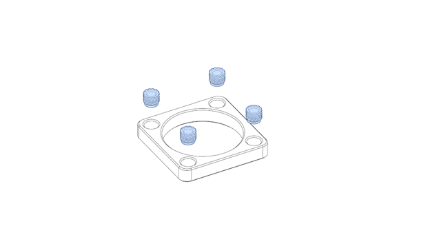

3. Align the printed part behind the PCB, place the 30 mm fan above the PCB.

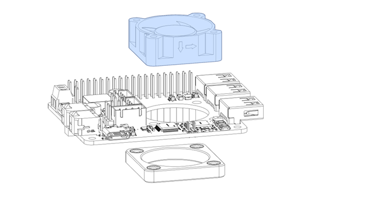

4. Use the appropriate size M3 screws (usually 12 mm for 3007 fans, 16mm for 3010 fans) to screw the fan to the printed part with the PCB in between.

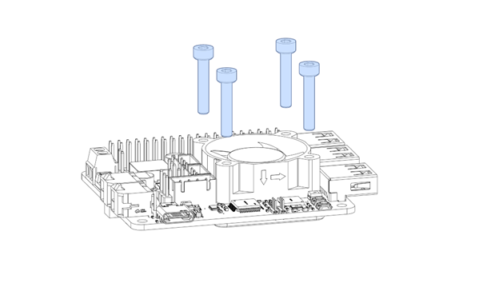

#### 40mm Fans

!!! info "40mm fans may block the MOAR_CAN connector, preventing the installation of the jumper. This is an older design from before this PCB jumper was designed."

1. Print the 3D printed part from the [GitHub repo](https://github.com/xbst/ToqueCAN/blob/master/Fan-Mounts/40mm_Fan_Holder.stl).
2. Insert 8x M3x5x4 (Voron size) threaded inserts.

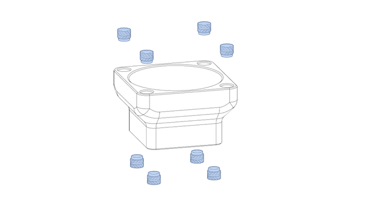

3. Align the printed part on the PCB, screw 4x M3 6mm screws with plastic washers from the other side of the PCB to secure it.

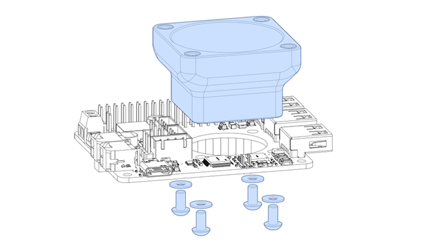

​	You can use nylon washers if you have them. If not, printable washers are available on the [GitHub repo](https://github.com/xbst/ToqueCAN/blob/master/Fan-Mounts/40mm_Fan_M3_Washer.stl).

4. Place the 40 mm fan above the printed part. Use the appropriate size M3 screws (usually 16 mm for 4010 fans, 25mm for 4020 fans) to screw the fan to the printed part.

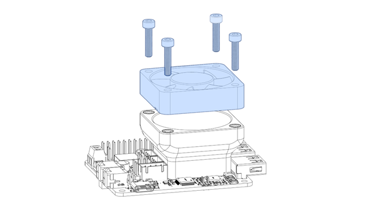

### 2. ToqueCAN Installation on Pi

1. Insert the M2.5x4.2x3.6 inserts to your mount if your mount supports it.
2. Screw a M2.5 6mm screw in the corner with GPIO and USB/Ethernet (depending on your Pi’s version) on your Raspberry Pi.

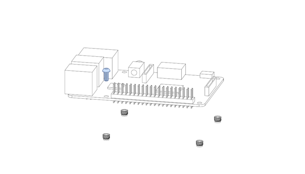

3. Screw 3x M2.5 14mm standoffs in the other screw holes.

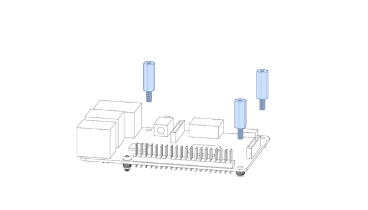

4. If you’re using the ToqueCAN USB C Cable Adapter, connect the USB cable to the Pi, route it between the USB / Ethernet connectors to where the USB connector of the ToqueCAN will be.

!!! info "This is the adapter PCB included with Isik's Tech ToqueCANs made before March 2026. These PCBs have 1 male and 1 female USB C connector, and helps make cable routing between ToqueCAN's USB C port and a USB A port on your Pi. ToqueCANs made after March 2026 instead include a PCB with 2 male USB C connectors. This will be covered later in this document."

5. Mount the ToqueCAN on the GPIO pins of your Pi.

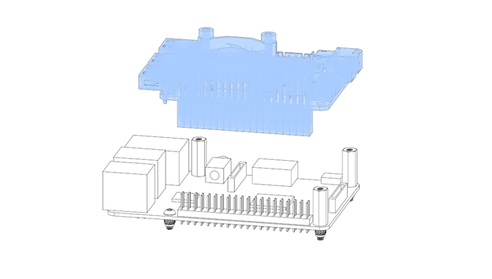

6. Screw 3x M2.5 6mm screws in the corner holes.

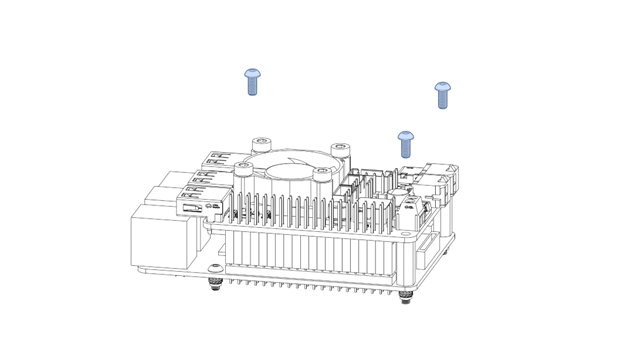

### 3. Jumpers

There are 3 sets of jumpers on the ToqueCAN, highlighted below:

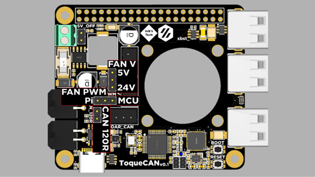

- 5V_OFF: Turns off the 5V regulator on the PCB. Leave unpopulated for ToqueCAN to generate 5V for the Raspberry Pi, USB devices and other devices powered by the 5V rail.

- CAN_120R: The 120Ω termination resistor for CAN bus. Populate it if you are connecting 1 CAN device to the Microfits, don’t populate if you’re using both. For its use with MOAR_CAN, refer to that section of this document.

- FAN_PWM: The PWM source for the 30/40mm fan, if you are using a PWM capable fan. This lets you control the fan’s speed. You need to use Pi’s control if you are using Candlelight as your CAN firmware, with Klipper in bridge mode you can use the Pi or the MCU.

- FAN_V: Voltage of the 30/40mm fan. 5V from the regulator or 24V from the power input.

#### MOAR_CAN

If you're not planning to connect a MOAR_CAN CAN bus hub to your ToqueCAN, populate the MOAR_CAN connector with the included jumper PCB.

### 4. Fan & Neopixels

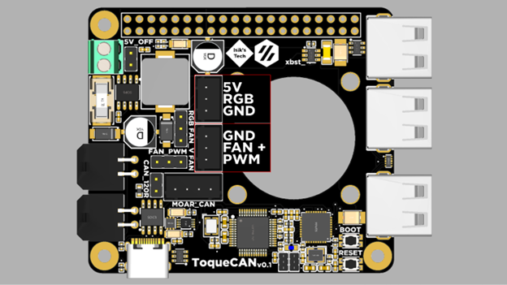

!!! info "Neopixels are only compatible with Klipper (in bridge more) firmware, you can’t use them with Candlelight."

### 5. Power

ToqueCAN is designed for 24V power. There is a 10A fuse on the PCB to protect the ToqueCAN and attached devices. The maximum TOTAL power draw available through the CAN connectors is 8A, the rest is used for the 5V regulator and some safety margin.

Power the ToqueCAN using the screw terminal. Ferrules are recommended.


### 6. USB C Pi 4/5 Adapter

!!! info "This is the adapter PCB included with Isik's Tech ToqueCANs made after March 2026. These PCBs have 2 male USB C connectors. These are only compatible with Raspberry Pi 4 and 5 B models. If your ToqueCAN is older, or if you're using a different Pi, you can use the old adapter board covered earlier in the docs, or just connect a USB cable"

1. SSH into your Raspberry Pi.
2. Edit the `config.txt` file in `/boot` by using `sudo nano /boot/config.txt`. You may need to enter your password again for sudo.
3. Add `dtoverlay=dwc2,dr_mode=host` to the bottom of the file in a new line.
4. Press `CTRL + X`, then `Y`, then `ENTER` to save and exit.
5. Reboot your Raspberry Pi (`reboot now`)
6. Plug in the PCB. It's ready to use.

### 7. Firmware

### Klipper Bridge Mode (Recommended)

1. SSH into your Raspberry Pi.
2. Navigate to the Klipper directory: `cd ~/klipper`
3. Clean old build data: `make clean`
4. Configure the build settings: `make menuconfig`. Use these settings:
   

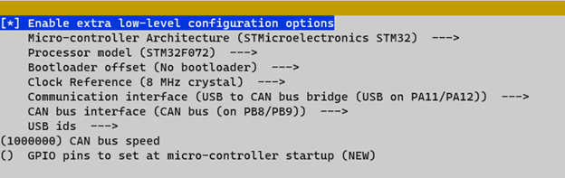

5. Press `Q` to exit, `Y` to save.

6. Plug in your ToqueCAN while holding down the `BOOT` button.

7. Use `lsusb` to verify that the ToqueCAN’s MCU (STM32F072) is in DFU mode.

8. Flash the firmware: `make flash FLASH_DEVICE=0483:df11`

#### Candlelight

1. SSH into your Raspberry Pi.
2. Install dependencies:

```
sudo apt-get install cmake gcc-arm-none-eabi git dfu-util
```

3. Download the firmware: (By Lab4450)

```
cd ~
git clone https://github.com/lab4450/u2c
cd u2c
```

4. On your ToqueCAN, hold down the `BOOT` button, while holding it down press the `RESET` button, then release the `BOOT` button. The blue LED should turn on.
5. Use `lsusb` to verify that the ToqueCAN’s MCU (STM32F072) is in DFU mode.
6. Flash the firmware:

```
sudo dfu-util -D candleLight_fw.bin -d 0483:df11 -a 0 -s 0x08000000:leave
```

### 8. CAN Bus

1. If this is your first time enabling CAN Bus on this printer, you need to enable the CAN network on your host device (Pi). To do this, you need to create a file. Use this command: (SSH)

``````
sudo nano /etc/network/interfaces.d/can0
``````

​	Add this to the file you’re creating:

``````
allow-hotplug can0
iface can0 can static
		bitrate 1000000
		up ifconfig $IFACE txqueuelen 1024
``````

​	Press `Q` to exit, `Y` to save.

2. Shutdown your host using: `sudo shutdown now`
3. When the LEDs on the Pi stop blinking, turn off your power supply to disconnect your ToqueCAN from power.
4. Crimp the microfits on the wires of your CAN devices. Pinout:


5. Plug in your CAN devices.
6. Turn your power supply back on and SSH into your Pi.
7. If your CAN devices aren’t flashed with CanBoot/Katapult and/or Klipper yet, use their instructions to flash them.
8. Use this Klipper script to check if your CAN devices are detected and what their UUIDs are:

```
~/klippy-env/bin/python ~/klipper/scripts/canbus_query.py can0
```

### 9. PWM Fan Control

#### Klipper

This step is optional. You only need to follow this step if you are using Klipper in bridge mode as your ToqueCAN’s firmware and want to use Klipper to control the PWM fan and Neopixels.

1. Download the config file from the ToqueCAN [GitHub repo](https://github.com/xbst/ToqueCAN/blob/master/Firmware/toquecan.cfg).
2. Upload this to your config folder
3. Open it and edit your `canbus_uuid`. You can use the script from the last step of Step 8 to find what your UUID is. Save and close (don’t restart yet).
4. Open your `printer.cfg`. Add this line:

```ini
[include toquecan.cfg]
```

5. Save and close. Restart Klipper.

#### Candlelight

This step is optional. If you want to use your Raspberry Pi to control your PWM fan, and configured the jumpers correctly for this, follow these instructions:

1. SSH into your Raspberry Pi.
2. `sudo raspi-config`
3. Enter `Performance Options`
4. Enter `Fan`
5. Select `Yes`
6. Enter `14`
7. Adjust the trigger temperature.
8. When done, exit with `Finish`, and reboot.

### MOAR_CAN Connector

This is an optional connector for adding more CAN bus devices. This requires an external PCB or similar solution to wire all the CAN bus devices together.

A CAN hub PCB with proper CAN topology (most CAN hubs on the market follow a star topology, a linear bus hub is required), with connectors on both ends of the CAN bus is required for connecting more CAN devices to ToqueCAN. Isik’s Tech’s MOAR_CAN PCB can be used for this.

More information about the Isik’s Tech MOAR_CAN:

[https://docs.isiks.tech/MOAR_CAN/MOAR_CAN-Manual/](https://docs.isiks.tech/MOAR_CAN/MOAR_CAN-Manual/)

To use the ToqueCAN with a MOAR_CAN or similar CAN Bus hub PCB, you need to run 2 pairs of twisted CAN wires from the MOAR_CAN connector on the ToqueCAN. The inner and outer pairs of wires need to be twisted together. The 120Ω termination resistor jumper on the ToqueCAN should not be jumped. There should be a termination resistor on the 2 CAN devices connected to the ToqueCAN. All the CAN devices connected together need to share the same GND, so the GND of the CAN bus hub needs to be connected to the same source as ToqueCAN, or if using separate power supplies, GNDs of both power supplies need to be connected together with a thick wire.

Follow the manual / documentation of the CAN bus hub you are using for information about how CAN devices need to connect to the CAN hub. Isik’s Tech MOAR_CAN documentation can be found on its GitHub repository.

### Debugging

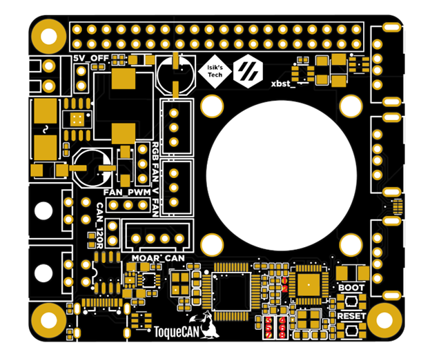

| **Pin**      | **1**   | **2**   | **3** | **4**   | **5** | **6** | **7** | **8** |
| ------------ | ------- | ------- | ----- | ------- | ----- | ----- | ----- | ----- |
| **Chip**     | USB2514 | USB2514 | -     | USB2514 | STM32 | STM32 | -     | STM32 |
| **Function** | SDA     | SCL     | 3.3V  | Reset   | Reset | SWDIO | GND   | SWCLK |

Pins 3,5,6,7,8 can be used to flash new firmware to bricked (DFU not working) STM32F072 MCUs, or to access other ST-Link features. You can use the buttons for BOOT0 and RESET.

Pins 1,2,3,4,7 can be used to flash new firmware to the USB hub controller (USB2514B-I/M2) via I2C, or to reset it. 

### More Resources

- Esoterical's CAN Bus Guide: https://canbus.esoterical.online/
- Klipper CAN Bus Docs: https://www.klipper3d.org/CANBUS.html

- Klipper CAN Bus Troubleshooting: https://www.klipper3d.org/CANBUS_Troubleshooting.html

- Lab4450 U2C Candlelight Firmware: https://github.com/lab4450/u2c

- GitHub Repository of the Project: https://l.isiks.tech/ToqueCAN

### Thanks

- Doc

- Le0n (logo)

- Thebrakshow

- Esoterical

- alexz

- Kyleisah

- whoppingpochard

- etherwalker
