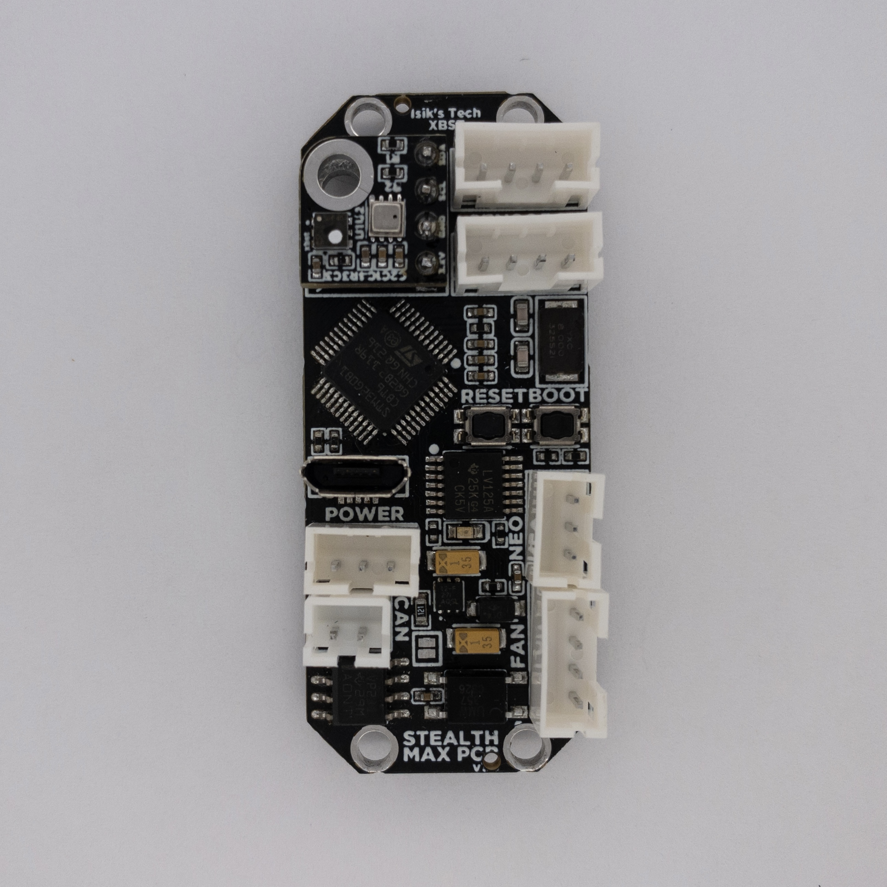
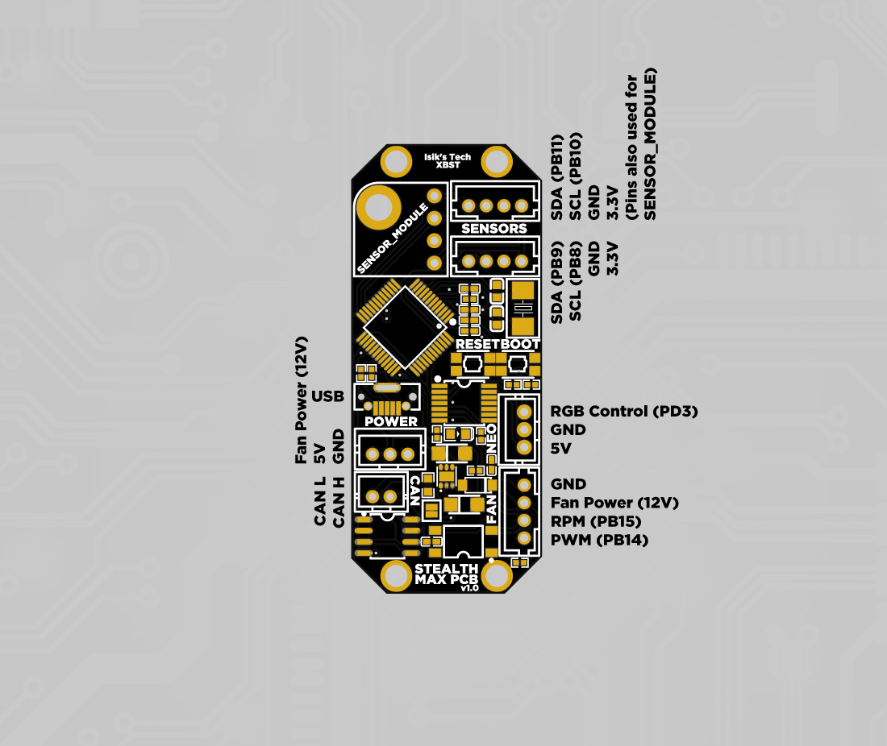

---
hide:
  - footer
---

# Nevermore Mini & Stealthmax PCB

Controller PCB for the [Nevermore Mini](https://www.printables.com/model/757663-nevermore-mini-3d-printer-hepa-and-carbon-air-filt) and [Nevermore Stealthmax](https://github.com/nevermore3d/StealthMax) air filters.

## Mount

Mount the PCB where the Raspberry Pi Pico normally mounts with M2 screws.

## Wiring

All connectors except USB are JST-PH. Use the diagram below to wire your fans, sensors, CAN, and power.

## Next Steps

Proceed to [Firmware & Software Setup](firmware-setup.md) for flashing instructions, SGP40 plugin installation, and Klipper config.
