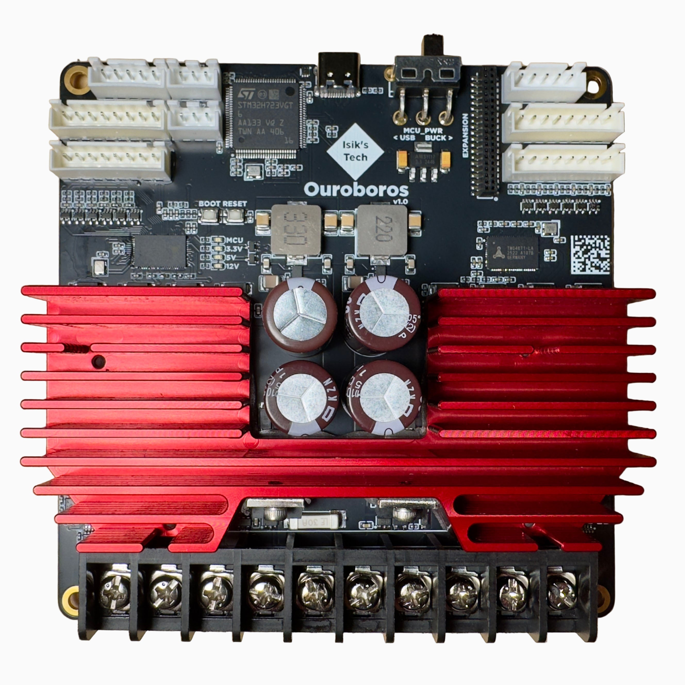

# Ouroboros

Ouroboros is a TMC4671 based FOC motor controller board designed for Klipper 3D printers, supporting stepper and BLDC motors. Ouroboros can control 2 motors, so you can control both X and Y motors of your printer. FOC (field oriented control) can reduce resonances originating at the motor, improving print quality. FOC can also help make your printer quieter, and lower motor temperatures. It can also compensate for skipped steps, avoiding crashes, layer shifts and print failures.

## Ouroboros Features

- 2x TMC4671 FOC Motor Controllers, for Stepper or BLDC Motors
- Up to 15A Peak Current per Motor, 30A Total
- 24-48V Input
- Optical (ABZ), Hall Effect and Analog Encoder Inputs for Each Motor
- STM32H723 MCU, USB C
- 2x Endstop Inputs
- STATUS Outputs Wired to the MCU for Sensorless Homing
- Built-In Brake Resistors
- MOSFET Temperature Sensors for Over-Temperature Protection
- Expansion Connector with CAN, UART, SPI and GPIO Pins
- CNC-Milled, Anodized Heatsink
- Assembled in the USA

## Resellers
### United States
- [Isik's Tech Official Store](https://store.isiks.tech/products/ouroboros)
- [West3D](https://west3d.com/products/ouroboros-tmc4671-stepper-servo-controller)

### United Kingdom
- [One Two 3D](https://www.onetwo3d.co.uk/product/isiks-tech-ouroboros-tmc4671-stepper-servo-controller/)

### Australia
- [DREMC](https://store.dremc.com.au/en-us/products/ouroboros-tmc4671-stepper-servo-controller-by-isiks-tech)

## Documentation

Set up Ouroboros in this order:

1. [Mount & Wiring](wiring.md): a mount for your printer, the interactive pinout, and motor, encoder and expansion wiring.
2. [Firmware Setup](firmware-setup.md): install the TMC4671 Klipper plugin, flash Ouroboros, and edit your `printer.cfg`.
3. [Stepper Motors](stepper-calibration.md): configure your encoder steppers, let the plugin autotune them, and adjust the PI loops by hand if you need to. BLDC motor setup is coming soon.

Optional and reference:

- [Sensorless Homing](sensorless-homing.md): home X and Y against the hard stops, without endstop switches.
- [TMC4671 Plugin Reference](plugin-reference.md): the plugin's G-code commands and config options.

## How FOC Works

??? info "FOC Interactive playground [BETA]"
    If you're used to traditional stepper drivers, FOC and closed loop may be new to you. The playground below builds it up from what you already know, in nine short chapters: STEP and DIR, microstepping, what's inside a stepper driver, StealthChop and StallGuard, and why a higher voltage helps, then open vs closed loop, FOC, the four PI loops you tune on Ouroboros, and sensorless homing with FOC. Every chapter is a live simulation: move the controls, break things, and watch the motor, the gantry and the scope react. Where a control matches an Ouroboros config option, its name is shown under it. The motors are a simplified teaching model, so the numbers show how things behave, not your printer's exact values.
    
    { type=application/pinout style="height:80vh;min-height:640px;width:100%" }
