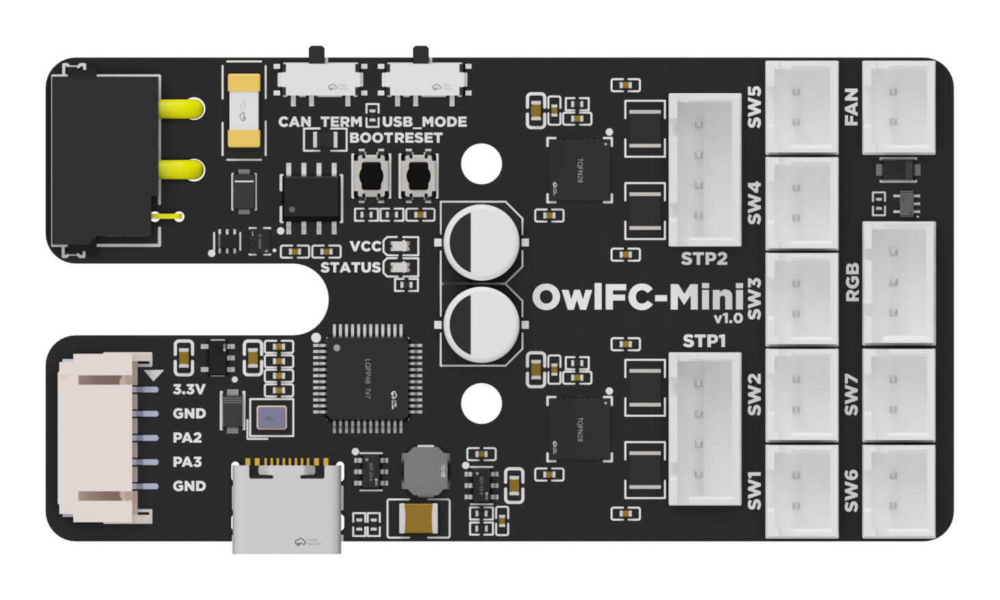

---
hide:
  - footer
---

# OwlFC-Mini Manual



## OwlFC-Mini Features

OwlFC-Mini is a 2-lane filament changer controller PCB designed for [NightOwl](https://github.com/mjonuschat/NightOwl/) filament changers. It features:

- 2x Onboard TMC2209 Stepper Drivers
- 7x Internal, 2x External Switch Connectors
- 1x ARGB LED Connector
- 1x Fan Connector (Optional, Always-On)
- STM32G0B1 MCU
- USB and CAN Support (Onboard MUX)
- 5V 1A Buck Converter

## Resellers
### United States
- [Isik's Tech Official Store](https://store.isiks.tech/products/owlfc-mini)

## Pinout

{ type=application/pinout style="height:80vh;min-height:500px;width:100%" }

- VIN is 4A fused.
- The fan connector is always-on and runs at VIN voltage.

### USB/CAN Mode Switch

OwlFC-Mini carries both power and data over its single Power & Data In connector. The H and L pins of this connector act either as CAN_H/CAN_L or as USB D+/D-, selected with the USB/CAN Mode Switch:

- **CAN position**: H and L are CAN_H and CAN_L. Connect them to your CAN bus.
- **USB position**: H and L are USB D+ and D-. To connect them to a USB port on your host, use the [USB Adapter](https://store.isiks.tech/products/usb-adapter) to protect your SBC.

The USB C port on the board is only used for firmware flashing, it's not easy to access when mounted inside a NightOwl.

### CAN Termination Switch

This switch connects a 120Ω termination resistor across the CAN lines. Set it to the "Terminated" position if the OwlFC-Mini is at an end of your CAN bus, and to the "No Termination" position otherwise. A CAN bus needs exactly two termination resistors, one at each end of the bus.

## Firmware Flashing (CAN with Katapult)

First of all, make sure CAN is already set up on your printer. You can follow Esoterical's guide here: <https://canbus.esoterical.online/>

1. Set the USB/CAN Mode Switch to the CAN position.
2. Connect the OwlFC-Mini's Power & Data In connector to power and your CAN bus, connect a USB C cable, and turn it on.
3. SSH into Pi.
4. Install Katapult using `git clone https://github.com/Arksine/katapult`.
5. Go to `~/klipper`, do a `make clean`, then `make menuconfig`, use the Klipper settings below, then `make`.
6. Go to the Katapult directory `cd ~/katapult/`, do a `make clean`, then `make menuconfig`, use the Katapult settings below, then `make`.
7. On the OwlFC-Mini, hold the BOOT button. While holding it press and release the RESET button, then release the BOOT button.
8. Use `lsusb` to verify that your OwlFC-Mini is in DFU mode.
9. Flash Katapult using `sudo dfu-util -a 0 -d 0483:df11 --dfuse-address 0x08000000:leave -D out/canboot.bin`.
10. Use `~/klippy-env/bin/python ~/klipper/scripts/canbus_query.py can0` to find OwlFC-Mini's UUID. It'll say Canboot next to it.
11. Flash Klipper using `cd ~/katapult/scripts && python3 flashtool.py -i can0 -f ~/klipper/out/klipper.bin -u <uuid>`, replace `<uuid>` with your OwlFC-Mini's UUID.
12. Disconnect the USB C cable.

Klipper settings:

```
[*] Enable extra low-level configuration options
    Micro-controller Architecture (STMicroelectronics STM32)  --->
    Processor model (STM32G0B1)  --->
    Bootloader offset (8KiB bootloader)  --->
    Clock Reference (8 MHz crystal)  --->
    Communication interface (CAN bus (on PD0/PD1))  --->
(1000000) CAN bus speed
[*] Optimize stepper code for 'step on both edges'
()  GPIO pins to set at micro-controller startup
```

Katapult settings:

```
    Micro-controller Architecture (STMicroelectronics STM32)  --->
    Processor model (STM32G0B1)  --->
    Build Katapult deployment application (Do not build)  --->
    Clock Reference (8 MHz crystal)  --->
    Communication interface (CAN bus (on PD0/PD1))  --->
    Application start offset (8KiB offset)  --->
(1000000) CAN bus speed
    Build Optimization Override (Size (-Os))  --->
()  GPIO pins to set on bootloader entry
[*] Support bootloader entry on rapid double click of reset button
[ ] Enable bootloader entry on button (or gpio) state
[*] Enable Status LED
(PA13)  Status LED GPIO Pin
```

## Firmware Flashing (USB)

1. Set the USB/CAN Mode Switch to the USB position.
2. Connect the OwlFC-Mini to power and USB using the adapter, turn it on.
3. SSH into Pi.
4. Go to `~/klipper`, do a `make clean`, then `make menuconfig`, use the settings below, then `make`.
5. On the OwlFC-Mini, hold the BOOT button. While holding it press and release the RESET button, then release the BOOT button.
6. Use `lsusb` to verify that your OwlFC-Mini is in DFU mode.
7. Flash Klipper using `make flash FLASH_DEVICE=0483:df11`.
8. Use `ls /dev/serial/by-id/*` to find your OwlFC-Mini's serial address.

```
[*] Enable extra low-level configuration options
    Micro-controller Architecture (STMicroelectronics STM32)  --->
    Processor model (STM32G0B1)  --->
    Bootloader offset (No bootloader)  --->
    Clock Reference (8 MHz crystal)  --->
    Communication interface (USB (on PA11/PA12))  --->
    USB ids  --->
[*] Optimize stepper code for 'step on both edges'
()  GPIO pins to set at micro-controller startup
```

To use USB for the Klipper connection when deployed, set the USB/CAN Mode Switch to the USB position and connect the H (D+) and L (D-) pins of the Power & Data In connector to your host using the [USB Adapter](https://store.isiks.tech/products/usb-adapter).

## Software Setup

OwlFC-Mini is supported by the following filament changer software packages. Follow their documentation to install the software and configure your NightOwl, including the Klipper config for the OwlFC-Mini itself:

- [AFC (AFC Klipper Add-On)](https://github.com/AFCProject/AFC-Klipper-Add-On)
- [Happy Hare](https://github.com/moggieuk/Happy-Hare)

!!! info "OwlFC-Mini support is being added to AFC and Happy Hare. If you can't find OwlFC-Mini or NightOwl configs in your installed version yet, update the software or check back soon."

## Printed Parts

OwlFC-Mini uses a printed mount and a connector cover, which can be found on the [OwlFC-Mini GitHub repository](https://github.com/xbst/OwlFC-Mini).

| Part | Download |
|---|---|
| Insert | [Insert.stl](https://raw.githubusercontent.com/xbst/OwlFC-Mini/refs/heads/master/CAD/Printed-Parts/Insert/Insert.stl) |
| Corner | [Corner.stl](https://raw.githubusercontent.com/xbst/OwlFC-Mini/refs/heads/master/CAD/Printed-Parts/Corner/Corner.stl) |

## Thanks

- mjonuschat
- thomasfjen
- adamstorm
- jimmyjon711
- Schlonky
- Ravn
- thunderkeys
- Sanity
