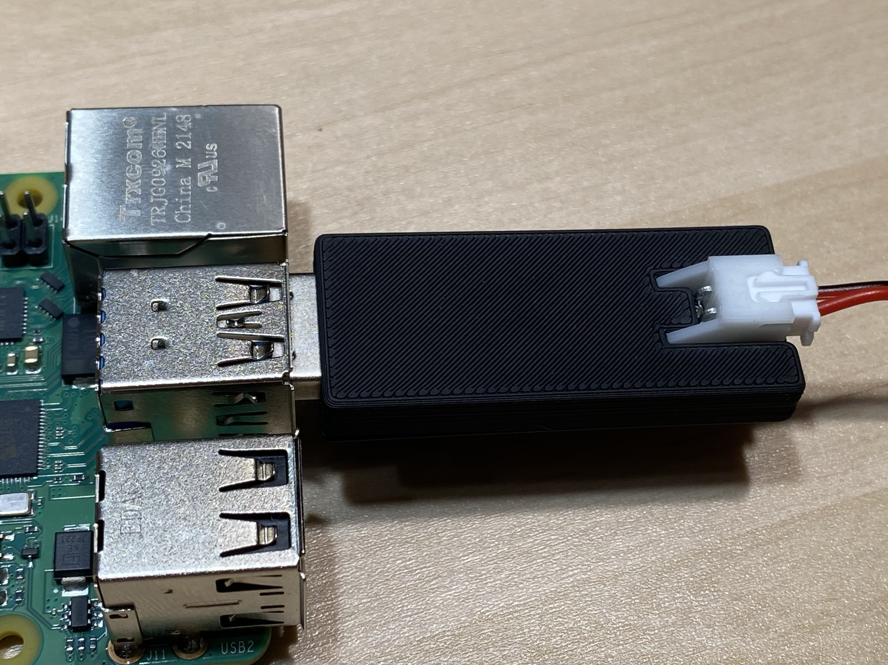
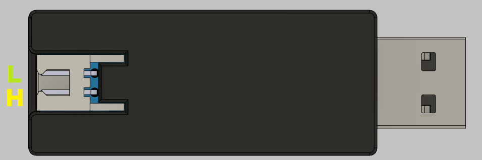

---
hide:
  - footer
---

# PiCAN Manual

PiCAN is a compact, USB-drive-shaped USB-to-CAN adapter designed primarily for 3D printers running Klipper firmware.

## Resellers

### Isik's Tech (US-Based — Ships Globally)

- [Isik's Tech Store](https://store.isiks.tech/products/pican-usb-to-can-bus-adapter)
- [Amazon — Prime Shipping](https://www.amazon.com/Isiks-Tech-PiCAN-Adapter-Printers/dp/B0CGLC87S5?maas=maas_adg_67FD4409E83516E2C5BBA977580D0B6B_afap_abs&ref_=aa_maas&tag=maas)

### United States

- [West3D](https://west3d.com/products/pican-a-tiny-usb-to-can-bus-adapter-by-isikstech)

### Canada

- [Amazon — Ships from the US](https://www.amazon.ca/dp/B0CGLC87S5)

### European Union

- [Lab4450 — Portugal](https://lab4450.com/product/pican-usb-to-can-adapter/)

### Australia

- [Unique Prints](https://uniqueprints.shop/shop/electronics-electrical/pcb/pican-usb-to-can-adaptor-for-klipper/)
- [DREMC](https://store.dremc.com.au/products/pican-usb-to-can-bus-adapter)

## Firmware

!!! info "Official PiCAN boards are pre-flashed"

    PiCAN boards sold by Isik's Tech arrive with firmware installed. Follow the flashing steps only if your board came from another source, has no firmware, or needs to be reflashed.

### Flashing the Firmware

1. Download the [U2C firmware](https://github.com/bigtreetech/U2C/blob/master/firmware/U2C_V1_STM32F072.bin).
2. Hold down the **BOOT** button on the PiCAN while connecting it to your computer.
3. Download and install [STM32CubeProgrammer](https://www.st.com/en/development-tools/stm32cubeprog.html).
4. In STM32CubeProgrammer, select **USB** from the connection selector below **Not connected** in the upper-right corner.
5. Click the refresh button beside the port selector, select **USB1**, and click **Connect**.
6. Expand **Device Memory**, select **Open File**, and choose the firmware file you downloaded.
7. Click **Download** to flash the firmware.

## Wiring and CAN Setup

Connect the CAN wires as shown below:

!!! warning "A common ground is required"

    Your Raspberry Pi and CAN devices must have their grounds connected. Devices powered from the same source should already share a ground. If you are unsure, disconnect power and verify continuity with a multimeter.

For CAN interface configuration and Klipper CAN device setup, follow the [official Klipper CAN bus documentation](https://www.klipper3d.org/CANBUS.html).

## More Resources
- [PiCAN GitHub repository](https://github.com/xbst/PiCAN)
- [PiCAN store page](https://store.isiks.tech/products/pican-usb-to-can-bus-adapter)
